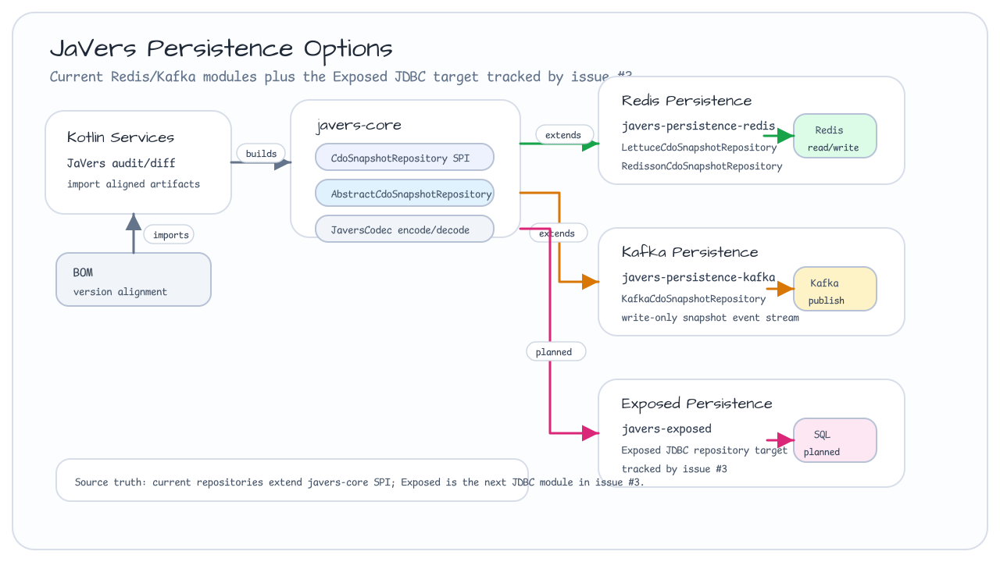

# bluetape4k-javers

[](https://github.com/bluetape4k/bluetape4k-javers/actions/workflows/ci.yml)
[](https://kotlinlang.org)
[](https://openjdk.org)
[](LICENSE)

[English](./README.md) | 한국어


[JaVers](https://javers.org) 객체 감사(audit)와 diff를 위한 Kotlin/JVM 통합 라이브러리입니다.
CDO snapshot과 event-sourced change stream을 위해 Exposed JDBC, Redis, Kafka persistence 선택지를 제공합니다.

## 프로젝트 목적

`bluetape4k-javers`는 JaVers의 기본 in-memory, MongoDB, JDBC 저장소 선택지를 확장합니다.
cache-backed read, Redis persistence, Kafka event stream, Exposed 기반 repository layer가
필요한 Kotlin 서비스의 audit/diff 인프라를 목표로 합니다.

JaVers의 object diff 모델을 쓰면서도 Kotlin-first helper, Exposed JDBC
persistence, cache/stream adapter, CQRS 예제를 함께 가져가야 하는 bluetape4k
서비스에 맞춘 저장소입니다.

## 제공 기능

- **JaVers core helper** — extension, codec, cache-backed repository 구성 요소
- **Exposed JDBC persistence** — SQL-backed JaVers CDO snapshot을 위한 Exposed schema와 repository
- **DDD helper** — JaVers audit workflow를 위한 aggregate root, domain event, repository, publisher adapter
- **CQRS command-side 예제** — `examples/javers-exposed-ddd` 아래 Exposed + JaVers + DDD helper 주문 command flow
- **Spring Boot 4 REST 예제** — `examples/javers-spring-boot4` 아래 Exposed command persistence와 JaVers audit history를 명시적으로 wiring하는 예제
- **Redis persistence** — Lettuce/Redisson 기반 snapshot 저장 경로
- **Kafka persistence** — event stream 기반 CDO snapshot persistence
- **BOM 지원** — 소비자 dependency version 정렬을 위한 `bluetape4k-javers-bom`
- **구현 backlog** — Exposed persistence, DDD helper, CQRS/Event Sourcing 예제 phase chain

## Persistence 선택지



## 아키텍처


<!-- README_VISUAL_OVERVIEW:START -->
## Overview Diagram


## Module Composition Chart


<!-- README_VISUAL_OVERVIEW:END -->

## 모듈

| 모듈 | Artifact | 역할 |
|---|---|---|
| `javers-core` | `io.github.bluetape4k.javers:javers-core` | JaVers extension, codec, cache-backed repository |
| `javers-ddd` | `io.github.bluetape4k.javers:javers-ddd` | JaVers audit workflow용 DDD aggregate/domain-event helper |
| `javers-exposed` | `io.github.bluetape4k.javers:javers-exposed` | Exposed JDBC CDO snapshot persistence |
| `examples-javers-exposed-ddd` | example module | Exposed persistence와 JaVers DDD helper를 사용하는 CQRS command-side 예제 |
| `examples-javers-spring-boot4` | example module | 명시적 Exposed/JaVers wiring을 사용하는 Spring Boot 4 REST 예제 |
| `javers-persistence-redis` | `io.github.bluetape4k.javers:javers-persistence-redis` | Redis/Lettuce/Redisson CDO snapshot persistence |
| `javers-persistence-kafka` | `io.github.bluetape4k.javers:javers-persistence-kafka` | Kafka-backed CDO snapshot persistence (쓰기 전용 이벤트 스트림; 읽기는 항상 빈 결과 반환) |
| `bluetape4k-javers-bom` | `io.github.bluetape4k.javers:bluetape4k-javers-bom` | JaVers artifact 정렬용 consumer BOM |

## 의존성 설정

여러 모듈을 함께 사용할 때는 BOM을 사용하세요:

```kotlin
dependencies {
    implementation(platform("io.github.bluetape4k.javers:bluetape4k-javers-bom:0.2.1"))
    implementation("io.github.bluetape4k.javers:javers-core")
    implementation("io.github.bluetape4k.javers:javers-exposed")
    implementation("io.github.bluetape4k.javers:javers-ddd")
}
```

Kafka, Redis, Exposed 모듈은 역할이 다르므로 애플리케이션이 실제로 사용하는
storage/eventing adapter만 추가하세요.

## 빠른 시작

```kotlin
val snapshotRepository = ExposedCdoSnapshotRepository(database)
snapshotRepository.ensureSchema()

val javers = JaversBuilder.javers()
    .registerJaversRepository(snapshotRepository)
    .registerEntity(Order::class.java)
    .build()
```

DDD command flow에서는 source-of-truth 저장소에 aggregate를 저장하고 JaVers에
commit한 뒤 domain event를 발행합니다. `examples/javers-exposed-ddd` 모듈은 이
경로를 Kafka event와 Redis read model까지 포함해 보여줍니다.

`examples/javers-spring-boot4` 모듈은 같은 JaVers + Exposed command persistence
흐름을 Spring Boot 4 REST endpoint 뒤에서 명시적으로 wiring해 보여줍니다. 아직
제공하지 않는 auto-configuration에 의존하지 않습니다.

## 요구사항

- JDK 21+
- Kotlin 2.3+
- JaVers 7.11.0

## 빌드

```bash
./gradlew build -x test
./gradlew build
./gradlew :javers-core:test
./gradlew :javers-ddd:test
./gradlew :javers-exposed:test
./gradlew :examples-javers-exposed-ddd:test
./gradlew :examples-javers-spring-boot4:test
./gradlew :javers-persistence-redis:test
./gradlew :javers-persistence-kafka:test
```

## 참고 자료

- [JaVers](https://javers.org)
- [JaVers Feature Overview](https://javers.org/features)
- [JaVers VS Envers Comparison](https://javers.org/blog/2017/12/javers-vs-envers-comparision.html)
- [Using JaVers for Data Model Auditing in Spring Data](https://www.baeldung.com/spring-data-javers-audit)
- [Spring Data에서 데이터 모델 감사를 위해 JaVers 사용](https://recordsoflife.tistory.com/486)
