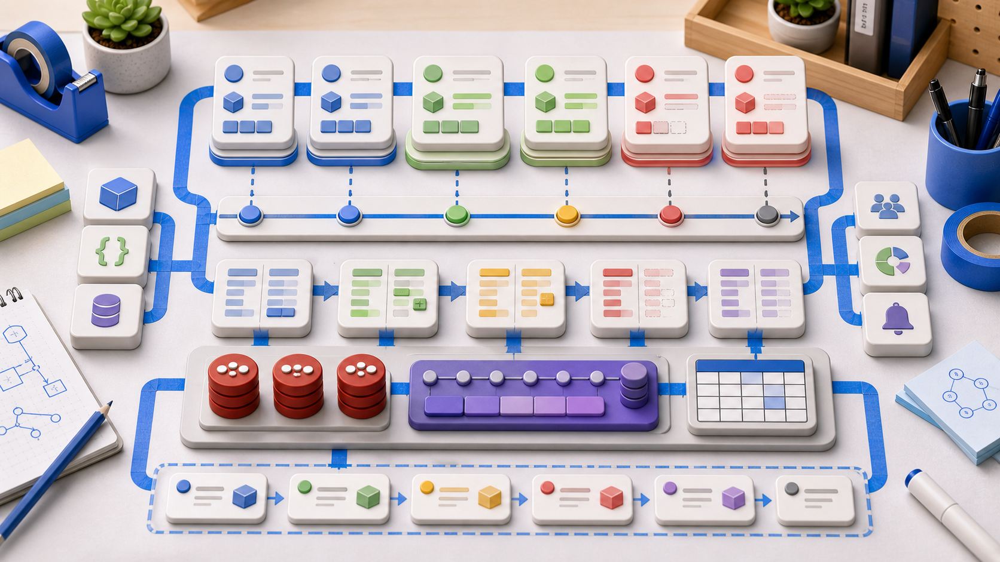
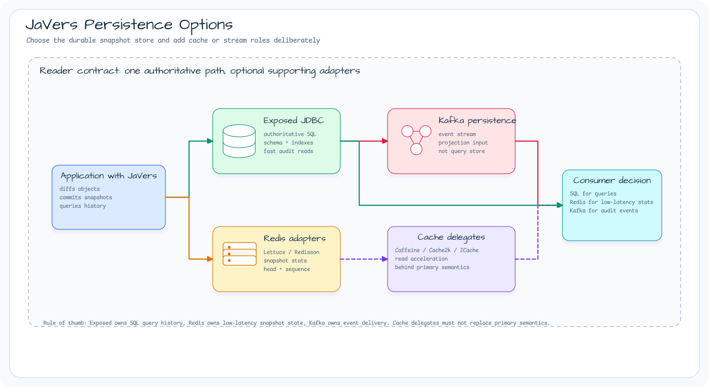
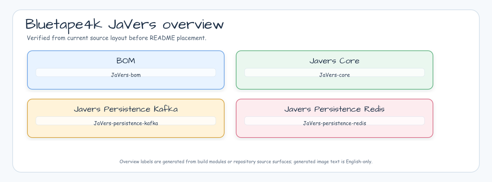
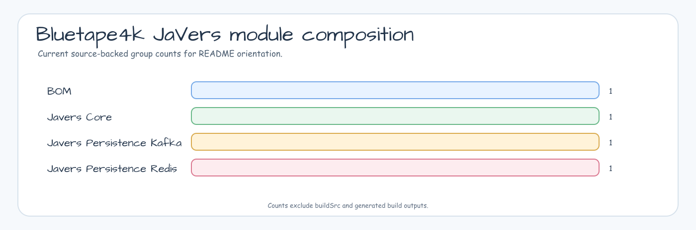
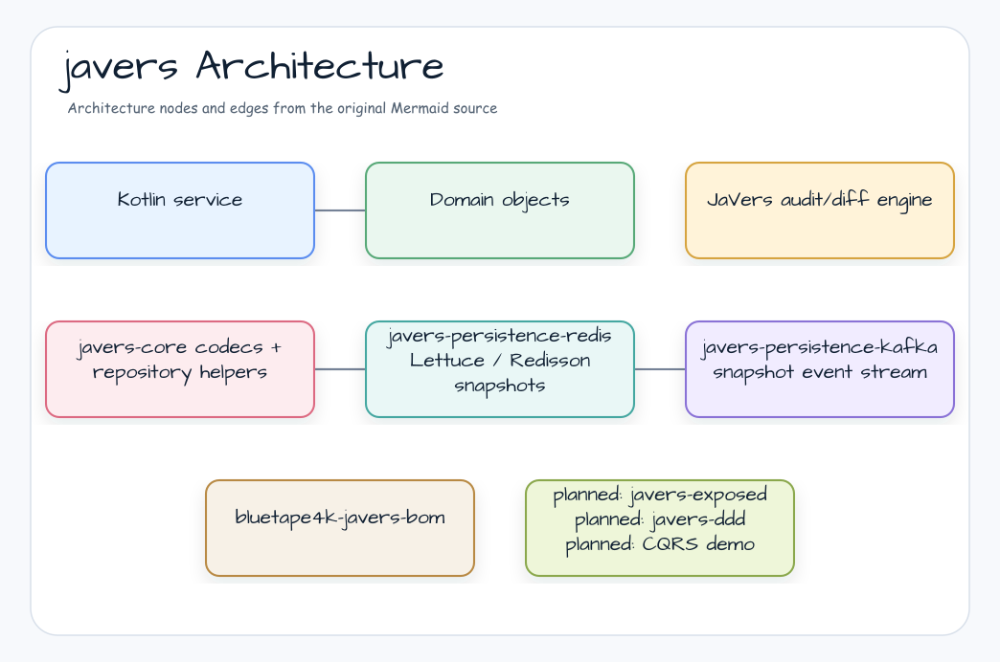
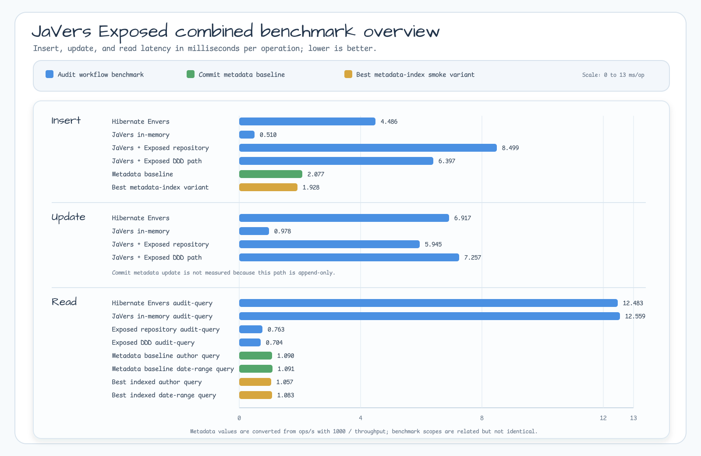

# bluetape4k-javers

[](https://github.com/bluetape4k/bluetape4k-javers/actions/workflows/ci.yml)
[](https://kotlinlang.org)
[](https://openjdk.org)
[](LICENSE)

English | [한국어](./README.ko.md)



Kotlin/JVM integrations for [JaVers](https://javers.org) object auditing and
diffing. The repository gives bluetape4k applications a practical way to choose
between SQL snapshots, Redis-backed snapshot state, Kafka audit events, and DDD
command-side examples without wiring every JaVers detail by hand.

## Project Purpose

`bluetape4k-javers` is for services that already want JaVers' object diff model,
but also need bluetape4k-style Kotlin APIs, explicit persistence choices, and
runnable examples. Start with `javers-core`, add the persistence adapter that
matches the application's audit contract, then use the examples and benchmarks
to validate the operational tradeoff.

The most important decision is where audit snapshots are authoritative. Exposed
is the SQL query path, Redis is a low-latency snapshot-state path, and Kafka is
an event delivery path for projections. They can be combined, but they should
not be treated as interchangeable stores.

## What It Provides

- **Core JaVers helpers** for Kotlin extensions, codecs, cache delegates, and
  composite CDO snapshot repositories.
- **Exposed JDBC persistence** for SQL-backed snapshots, repository-head
  recovery, and query behavior that can be benchmarked against Envers paths.
- **DDD helpers** for aggregate repositories, domain events, and publisher
  boundaries around JaVers commits.
- **Spring Boot 4 auto-configuration** for conditional JaVers repository and
  builder wiring across Exposed, Redis, and Kafka backends.
- **Redis persistence** through Lettuce and Redisson when snapshot state must be
  low-latency and recoverable after repository rebuilds.
- **Kafka persistence** for snapshot event delivery and projection pipelines,
  not for direct history queries.
- **Runnable examples** for Exposed DDD CQRS, Ktor REST, and Spring Boot 4 REST
  wiring.
- **BOM support** through `bluetape4k-javers-bom` for aligned consumer versions.

## Persistence Options



<!-- README_VISUAL_OVERVIEW:START -->
## Overview Diagram



## Module Composition Chart


<!-- README_VISUAL_OVERVIEW:END -->

## Architecture



## Modules

| Module | Artifact | Purpose |
|---|---|---|
| `javers-core` | `io.github.bluetape4k.javers:javers-core` | JaVers extensions, codecs, cache-backed and composite repositories |
| `javers-ddd` | `io.github.bluetape4k.javers:javers-ddd` | DDD aggregate/domain-event helpers for JaVers audit workflows |
| `javers-exposed` | `io.github.bluetape4k.javers:javers-exposed` | Exposed JDBC CDO snapshot persistence |
| `javers-persistence-redis` | `io.github.bluetape4k.javers:javers-persistence-redis` | Redis/Lettuce/Redisson CDO snapshot persistence |
| `javers-persistence-kafka` | `io.github.bluetape4k.javers:javers-persistence-kafka` | Kafka-backed CDO snapshot event stream for projections |
| `examples-javers-exposed-ddd` | example module | CQRS command-side example using Exposed persistence and JaVers DDD helpers |
| `examples-javers-ktor` | example module | Ktor REST example using explicit Exposed and JaVers wiring |
| `examples-javers-spring-boot4` | example module | Spring Boot 4 REST example using explicit Exposed and JaVers wiring |
| `javers-spring-boot4-autoconfigure` | `io.github.bluetape4k.javers:javers-spring-boot4-autoconfigure` | Spring Boot 4 conditional auto-configuration for Exposed, Redis, and Kafka JaVers repositories |
| `bluetape4k-javers-bom` | `io.github.bluetape4k.javers:bluetape4k-javers-bom` | Consumer BOM for aligned JaVers artifacts |

## Dependency Setup

Use the BOM when consuming more than one module:

```kotlin
dependencies {
    implementation(platform("io.github.bluetape4k.javers:bluetape4k-javers-bom:0.3.0"))
    implementation("io.github.bluetape4k.javers:javers-core")
    implementation("io.github.bluetape4k.javers:javers-exposed")
    implementation("io.github.bluetape4k.javers:javers-ddd")
    implementation("io.github.bluetape4k.javers:javers-spring-boot4-autoconfigure")
}
```

Add only the persistence adapters that the application actually uses. Exposed,
Redis, and Kafka intentionally serve different storage and eventing roles; the
BOM aligns versions but does not decide the runtime topology for you.

## Quick Start

```kotlin
val snapshotRepository = ExposedCdoSnapshotRepository(database)
snapshotRepository.ensureSchema()

val javers = JaversBuilder.javers()
    .registerJaversRepository(snapshotRepository)
    .registerEntity(Order::class.java)
    .build()
```

For Spring Boot 4 applications, add the auto-configuration module and select a
repository backend. The application still owns infrastructure beans such as
Exposed `Database`, Redis clients, Kafka producers, or `KafkaTemplate`.

```kotlin
dependencies {
    implementation("io.github.bluetape4k.javers:javers-spring-boot4-autoconfigure")
    implementation("io.github.bluetape4k.javers:javers-exposed")
}
```

```yaml
bluetape4k:
  javers:
    repository:
      type: exposed
```

For DDD command handling, write the aggregate to the source-of-truth store,
commit it to JaVers, then publish a domain event. The
`examples/javers-exposed-ddd` module shows this path with Kafka events and a
Redis read model.

The `examples/javers-spring-boot4` module shows the same explicit JaVers +
Exposed command persistence behind Spring Boot 4 REST endpoints when you prefer
manual wiring over auto-configuration.

The `examples/javers-ktor` module shows the same current feature set behind Ktor
REST endpoints for non-Spring users, reusing bluetape4k Ktor JSON and health
helpers.

## Requirements

- JDK 21+
- Kotlin 2.3+
- JaVers 7.11.0

## Build

```bash
./gradlew build -x test
./gradlew build
./gradlew :javers-core:test
./gradlew :javers-ddd:test
./gradlew :javers-exposed:test
./gradlew :examples-javers-exposed-ddd:test
./gradlew :examples-javers-ktor:test
./gradlew :examples-javers-spring-boot4:test
./gradlew :javers-persistence-redis:test
./gradlew :javers-persistence-kafka:test
./gradlew :javers-spring-boot4-autoconfigure:test
```

## Benchmark Snapshot

The comparison below is a bounded documentation benchmark, not a release-wide
performance claim. It was generated by
`./gradlew :examples-javers-exposed-ddd:test --tests '*EnversComparisonBenchmarkTest*' --no-configuration-cache --no-build-cache --no-parallel --console=plain`
with 5 warmup operations and 40 measured operations per scenario. Lower
milliseconds per operation is better.

Environment: PostgreSQL 18-alpine via Testcontainers, HikariCP, JDK 21.0.11,
macOS aarch64. Raw artifact:
[`docs/benchmark/2026-06-08-javers-exposed-ddd-envers-comparison.json`](docs/benchmark/2026-06-08-javers-exposed-ddd-envers-comparison.json).


| Implementation | Insert ms/op | Update ms/op | Audit-query ms/op |
|---|---:|---:|---:|
| Hibernate Envers | 4.486 | 6.917 | 12.483 |
| JaVers in-memory | 0.510 | 0.978 | 12.559 |
| JaVers + Exposed repository | 8.499 | 5.945 | 0.763 |
| JaVers + Exposed DDD path | 6.397 | 7.257 | 0.704 |

The Exposed lanes include PostgreSQL round trips through HikariCP. The DDD path
also includes source-of-truth order persistence and aggregate repository
orchestration, so compare it as an end-to-end example path rather than as a pure
snapshot repository cost.

### Commit Metadata Index Evaluation

Issue #188 evaluates optional secondary indexes on the JaVers Exposed commit
metadata table. The benchmark below is a dedicated `kotlinx-benchmark`/JMH
harness that uses PostgreSQL 18-alpine via Testcontainers, HikariCP,
`bluetape4k-jdbc`, `bluetape4k-exposed-jdbc`, and
`bluetape4k-exposed-jdbc-tests`. Scores are throughput in operations per second;
higher values are better.

Command:

```bash
./gradlew :benchmark-javers-exposed-benchmark:mainCommitMetadataSmokeBenchmark --no-configuration-cache --no-build-cache --no-parallel --console=plain
```

Raw artifact:
[`docs/benchmark/2026-06-08-javers-exposed-commit-metadata-indexes.json`](docs/benchmark/2026-06-08-javers-exposed-commit-metadata-indexes.json).


| Variant | Insert ops/s | Author query ops/s | Date-range query ops/s | Decision signal |
|---|---:|---:|---:|---|
| Baseline | 481.4 | 917.5 | 916.5 | Stable reference for the current production schema. |
| Author index | 488.6 | 907.1 | 904.7 | No author-query benefit in this smoke run. |
| `commit_date` index | 499.3 | 931.2 | 923.2 | Slight read throughput gain, but bounded evidence only. |
| Author + `commit_date` indexes | 518.6 | 945.9 | 873.8 | Best author-query throughput, but weaker date-range throughput. |

The candidate indexes are created only inside the benchmark schema. Production
JaVers Exposed defaults remain unchanged because this short smoke run is mixed;
a broader workload benchmark must justify the extra DDL and write-amplification
cost before default indexes are added.

### Combined Interpretation

The two benchmark families answer different questions. The Envers comparison
measures broader audit workflows in milliseconds per operation, while the
commit metadata benchmark measures a narrower JaVers Exposed SQL pushdown path
in throughput. The table below converts the metadata benchmark to approximate
milliseconds per operation with `1000 / opsPerSecond` so insert, update, and
read-side results can be read on one latency scale. The commit metadata
benchmark does not include an update scenario because JaVers commit metadata is
append-only in this repository path.



| Path | Scope | Insert ms/op | Update ms/op | Read ms/op | Interpretation |
|---|---|---:|---:|---:|---|
| Hibernate Envers | Entity revision audit path | 4.486 | 6.917 | 12.483 audit-query | Baseline JPA audit path for the example domain. |
| JaVers in-memory | Core JaVers diff/query path | 0.510 | 0.978 | 12.559 audit-query | Fast writes and updates, but in-memory audit query is not the Exposed SQL path. |
| JaVers + Exposed repository | Snapshot repository path | 8.499 | 5.945 | 0.763 audit-query | Higher write cost, but repository read path is the fastest full audit-query lane here. |
| JaVers + Exposed DDD path | End-to-end example path | 6.397 | 7.257 | 0.704 audit-query | Adds source-table and aggregate orchestration, but keeps fast audit reads. |
| JaVers Exposed metadata baseline | Commit metadata author/date filters | 2.077 | Not measured | 1.090 author / 1.091 date-range | Current production schema is already near the Exposed audit-query order of magnitude for metadata reads. |
| Best metadata-index smoke variants | Benchmark-only candidate indexes | 1.928 | Not measured | 1.057 author / 1.083 date-range | Insert is slightly faster in the smoke run, but read gains remain small and mixed. |

Taken together, the Exposed repository remains the right read-side direction
against Envers for this workload, but it pays more on insert/update than the
in-memory path. The commit metadata index decision should stay conservative:
the indexed smoke variants improve insert a little and only some read filters,
while update is outside that append-only benchmark scope.

## References

- [JaVers](https://javers.org)
- [JaVers Feature Overview](https://javers.org/features)
- [JaVers VS Envers Comparison](https://javers.org/blog/2017/12/javers-vs-envers-comparision.html)
- [Using JaVers for Data Model Auditing in Spring Data](https://www.baeldung.com/spring-data-javers-audit)
