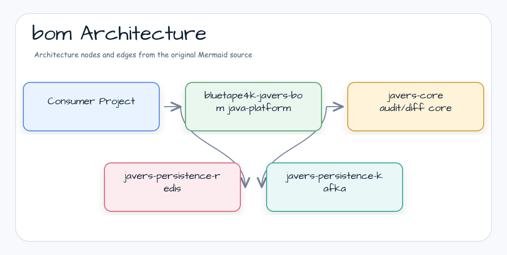

# bluetape4k-javers-bom

한국어 | [English](./README.md)

**bluetape4k-javers** 생태계용 Maven BOM (Bill of Materials). 애플리케이션이
둘 이상의 배포 JaVers artifact를 함께 사용할 때 `bluetape4k-javers-core`,
`bluetape4k-javers-ddd`, Exposed, Redis, Kafka artifact를 같은 release line으로
맞춥니다.

## Architecture



BOM은 Gradle `java-platform` 으로 배포 Maven artifact의 dependency-management
constraint만 게시합니다. runtime class, runnable module, ecosystem-level metadata,
auto-configuration, persistence topology 결정을 제공하지 않습니다.

## 핵심 기능

- 게시되는 `bluetape4k-javers` artifact 버전 중앙 관리
- core, DDD, Exposed, Redis, Kafka artifact ID의 JaVers audit/diff stack 정렬
- runtime class, runnable module, auto-configuration, persistence behavior 없음
- `bluetape4k-dependencies`가 상위에서 cross-ecosystem version을 통합

## 관리하는 배포 Artifact

| Artifact | 설명 |
|------|------|
| `bluetape4k-javers-core` | Javers audit/diff 코어 연동 |
| `bluetape4k-javers-ddd` | DDD aggregate와 domain-event helper layer |
| `bluetape4k-javers-exposed` | Exposed JDBC 기반 JaversRepository |
| `bluetape4k-javers-persistence-redis` | Redis 기반 JaversRepository |
| `bluetape4k-javers-persistence-kafka` | projection pipeline을 위한 Kafka snapshot event delivery |
| `bluetape4k-javers-spring-boot4-autoconfigure` | JaVers repository용 Spring Boot 4 조건부 auto-configuration |

## 사용 방법

### Gradle Kotlin DSL

```kotlin
plugins {
    id("io.spring.dependency-management") version "1.1.x"
}

dependencyManagement {
    imports {
        mavenBom("io.github.bluetape4k.javers:bluetape4k-javers-bom:<version>")
    }
}

dependencies {
    implementation("io.github.bluetape4k.javers:bluetape4k-javers-core")
    implementation("io.github.bluetape4k.javers:bluetape4k-javers-ddd")
    implementation("io.github.bluetape4k.javers:bluetape4k-javers-exposed")
    implementation("io.github.bluetape4k.javers:bluetape4k-javers-persistence-redis")
}
```

### 순수 Gradle

```kotlin
dependencies {
    implementation(platform("io.github.bluetape4k.javers:bluetape4k-javers-bom:<version>"))
    implementation("io.github.bluetape4k.javers:bluetape4k-javers-core")
}
```

### Maven

```xml
<dependencyManagement>
    <dependencies>
        <dependency>
            <groupId>io.github.bluetape4k.javers</groupId>
            <artifactId>bluetape4k-javers-bom</artifactId>
            <version>${bluetape4k-javers.version}</version>
            <type>pom</type>
            <scope>import</scope>
        </dependency>
    </dependencies>
</dependencyManagement>
```

## 설정 옵션

BOM 자체는 별도 설정이 없다. SNAPSHOT 사용 시 Sonatype Central Snapshots 저장소 추가:

```kotlin
repositories {
    mavenCentral()
    maven {
        name = "central-snapshots"
        url = uri("https://central.sonatype.com/repository/maven-snapshots/")
    }
}
```

## 의존성

이 BOM은 `bluetape4k-dependencies` 에서 자동 통합된다. 여러 bluetape4k 생태계를 함께 사용한다면
`io.github.bluetape4k:bluetape4k-dependencies` import 권장.
