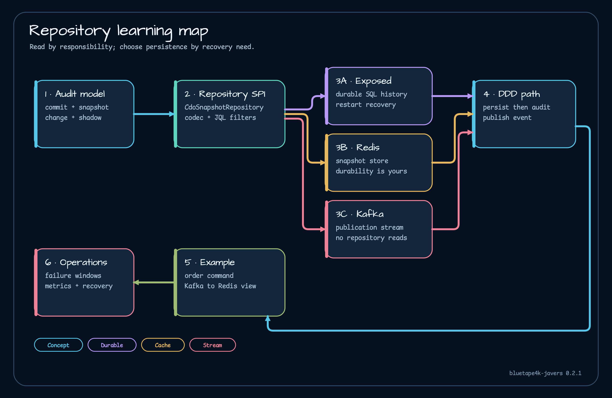

# bluetape4k-javers 0.2 manual

Object auditing becomes difficult when application state, audit history, and query projections are treated as one store. `bluetape4k-javers` 0.2.1 gives Kotlin services a JaVers audit layer with Exposed, Redis, and Kafka adapters, but each adapter has a different responsibility. This manual starts with those boundaries so that a service does not accidentally use a cache or stream as its only recoverable record.

The manual is pinned to release `0.2.1` (`bffe19439ca891fa5301a76421bdef7ba75252a0`). Ktor integration, Spring Boot 4 auto-configuration and examples, and the dedicated Gradle benchmark module were added after that release. They are not 0.2 features.

## Start here

- [Getting started](getting-started.md) installs a coherent ecosystem dependency set and creates a small Exposed-backed JaVers instance.
- [Repository map](architecture/repository-map.md) shows which module owns audit semantics, persistence, and event publication.
- [Persistence selection](persistence/selection-guide.md) compares Exposed, Redis, and Kafka by recovery and query needs.
- [Learning path](guides/learning-path.md) orders the material for application developers, library integrators, and operators.

## Use the manual by question

If you need to understand JaVers data, read [the audit model](architecture/audit-model.md). If you are composing storage, cache, or publication paths, read [repository composition](architecture/repository-composition.md) and [failure contracts](operations/failure-contracts.md). For a command-to-projection example, follow [DDD and CQRS](guides/ddd-and-cqrs.md). For production proof, use [testing](guides/testing.md) and [observability](operations/observability.md).

## Architecture, persistence, and operations

- [Audit model](architecture/audit-model.md) separates commits, snapshots, changes, and shadows.
- [Repository composition](architecture/repository-composition.md) explains the source-of-truth and adapter boundaries.
- [Persistence selection](persistence/selection-guide.md) compares the recovery contract of Exposed, Redis, and Kafka.
- [Exposed](persistence/exposed.md), [Redis](persistence/redis.md), and [Kafka](persistence/kafka.md) document each adapter in depth.
- [Failure contracts](operations/failure-contracts.md) and [observability](operations/observability.md) turn those boundaries into operational checks.

## Modules and runnable material

- Foundation: [Javers BOM](modules/bluetape4k-javers-bom.md), [javers-core](modules/javers-core.md), and [javers-ddd](modules/javers-ddd.md)
- Persistence: [javers-exposed](modules/javers-exposed.md), [javers-persistence-redis](modules/javers-persistence-redis.md), and [javers-persistence-kafka](modules/javers-persistence-kafka.md)
- Example: [JaVers + Exposed DDD order flow](examples/javers-exposed-ddd.md)
- Benchmarks: [how to read the evidence](benchmarks/overview.md) and the [JaVers, Exposed DDD, and Envers comparison](benchmarks/exposed-ddd-envers.md)
- Ecosystem path: [where this repository connects to Exposed and application architecture](guides/cross-repository-paths.md)

The release source is the behavior authority. The most important starting points are [`CdoSnapshotRepository`](https://github.com/bluetape4k/bluetape4k-javers/blob/bffe19439ca891fa5301a76421bdef7ba75252a0/javers-core/src/main/kotlin/io/bluetape4k/javers/repository/CdoSnapshotRepository.kt), [`AggregateRepository`](https://github.com/bluetape4k/bluetape4k-javers/blob/bffe19439ca891fa5301a76421bdef7ba75252a0/javers-ddd/src/main/kotlin/io/bluetape4k/javers/ddd/AggregateRepository.kt), and the [`javers-exposed-ddd` example](https://github.com/bluetape4k/bluetape4k-javers/tree/0.2.1/examples/javers-exposed-ddd).
