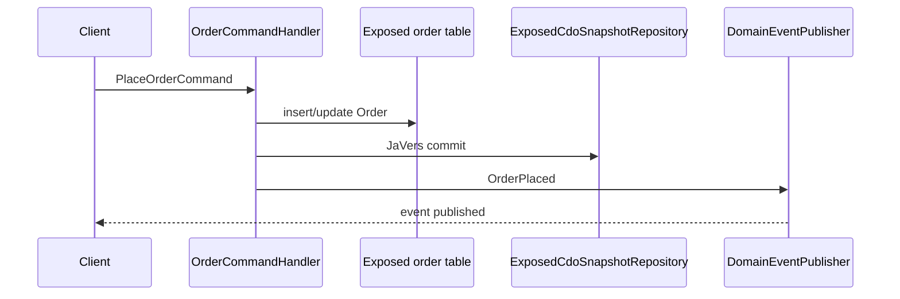

# javers-exposed-ddd

[English](./README.md) | 한국어

JaVers, Exposed JDBC, `javers-ddd` helper를 함께 사용하는 command-side CQRS
예제입니다.

## 흐름



## 포함 범위

- `AggregateRoot<OrderId>`를 구현하는 `Order` aggregate
- `OrderPlaced`, `OrderMarkedPaid` domain event
- Exposed 기반 source-of-truth 주문 저장
- `ExposedCdoSnapshotRepository`를 통한 JaVers snapshot 저장
- H2 기반 command handler 테스트

Kafka consumer, Redis projection, benchmark 결과는 parent issue #5의 다음
slice에서 다룹니다.

## 실행

```bash
./gradlew :javers-exposed-ddd:test
```
