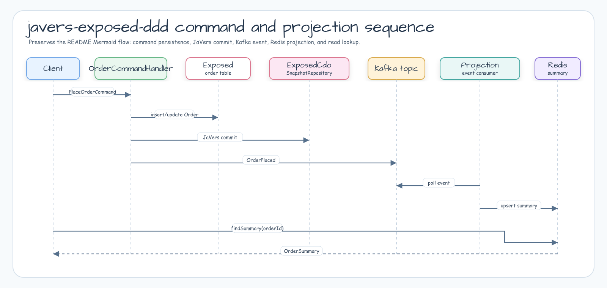
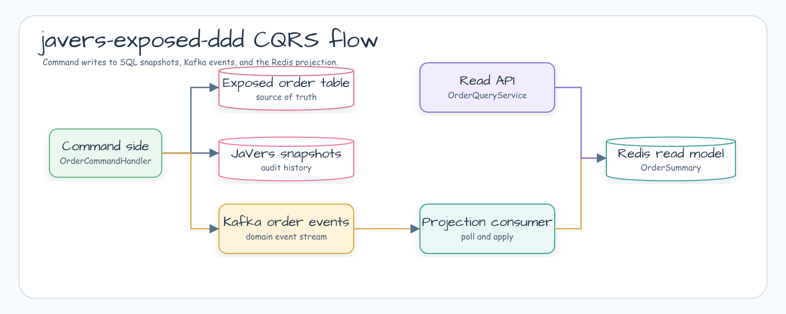
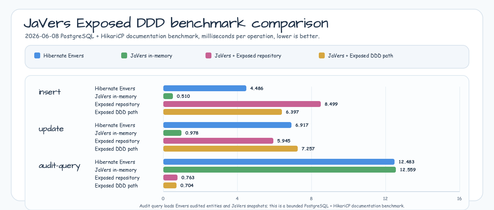
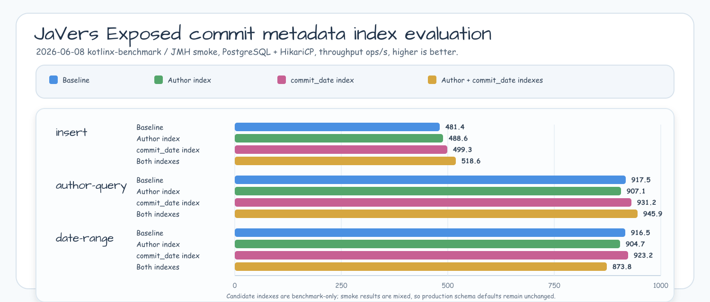

# examples-javers-exposed-ddd

[English](./README.md) | 한국어

JaVers, Exposed JDBC, Kafka, Redis, `javers-ddd` helper를 함께 사용하는 CQRS
예제입니다.

## 흐름





## 포함 범위

- `AggregateRoot<OrderId>`를 구현하는 `Order` aggregate
- `OrderPlaced`, `OrderMarkedPaid` domain event
- Exposed 기반 source-of-truth 주문 저장
- `ExposedCdoSnapshotRepository`를 통한 JaVers snapshot 저장
- Kafka 기반 domain event 발행
- Redis 기반 `OrderSummary` projection
- `OrderQueryService` read-side 조회 API
- H2 command handler 테스트와 Kafka/Redis Testcontainers projection flow

## Benchmark

Envers 비교 benchmark는 로컬 문서화용 benchmark이며, release 전체 성능
주장이 아닙니다. H2에서 이 예제의 단순 persistence shape만 측정합니다.
milliseconds per operation 값은 낮을수록 좋습니다.

명령:

```bash
./gradlew :examples-javers-exposed-ddd:test --tests '*EnversComparisonBenchmarkTest*' \
  --no-configuration-cache --no-build-cache --no-parallel --console=plain
```

환경과 원시 결과는
[`docs/benchmark/2026-06-08-javers-exposed-ddd-envers-comparison.json`](../../docs/benchmark/2026-06-08-javers-exposed-ddd-envers-comparison.json)에
저장되어 있습니다.



| Lane | insert ms/op | update ms/op | audit-query ms/op | 비고 |
|---|---:|---:|---:|---|
| Hibernate Envers | 1.084 | 1.528 | 10.236 | Hibernate entity revision table 경로입니다. audit query는 audited entity revision을 읽습니다. |
| JaVers in-memory | 0.490 | 0.939 | 12.208 | persistence adapter 전의 JaVers core diff/query 경로에 가깝습니다. |
| JaVers + Exposed repository | 3.039 | 1.765 | 0.309 | 예제 source table을 제외한 snapshot repository persistence/query 경로입니다. |
| JaVers + Exposed DDD path | 2.095 | 3.002 | 0.313 | `OrdersTable`과 aggregate repository orchestration을 포함한 예제 end-to-end 경로입니다. |

이 fresh run에서는 이전 JaVers + Exposed audit-query outlier가 재현되지
않았습니다. 이 benchmark는 여전히 H2 기반 문서화용 benchmark입니다. 표는
예제의 비용 구조를 이해하기 위한 자료이며, release 전체 성능 보장은
아닙니다.

### Commit Metadata Index 평가

Commit metadata index benchmark는 JaVers Exposed SQL pushdown 경로를
benchmark 전용 `author`, `commit_date` 인덱스 조합과 비교합니다.
Testcontainers PostgreSQL 18-alpine과 HikariCP를 사용하고, 전용
`kotlinx-benchmark` 모듈 안에서 `bluetape4k-jdbc`,
`bluetape4k-exposed-jdbc`, `bluetape4k-exposed-jdbc-tests`를 재사용합니다.
이 benchmark는 production schema 기본값을 변경하지 않습니다.

```bash
./gradlew :benchmark-javers-exposed-benchmark:mainCommitMetadataSmokeBenchmark \
  --no-configuration-cache --no-build-cache --no-parallel --console=plain
```

Raw artifact:
[`docs/benchmark/2026-06-08-javers-exposed-commit-metadata-indexes.json`](../../docs/benchmark/2026-06-08-javers-exposed-commit-metadata-indexes.json).



| Variant | Insert ops/s | Author query ops/s | Date-range query ops/s |
|---|---:|---:|---:|
| Baseline | 481.4 | 917.5 | 916.5 |
| Author index | 488.6 | 907.1 | 904.7 |
| `commit_date` index | 499.3 | 931.2 | 923.2 |
| Author + `commit_date` indexes | 518.6 | 945.9 | 873.8 |

## 실행

```bash
./gradlew :examples-javers-exposed-ddd:test
```
