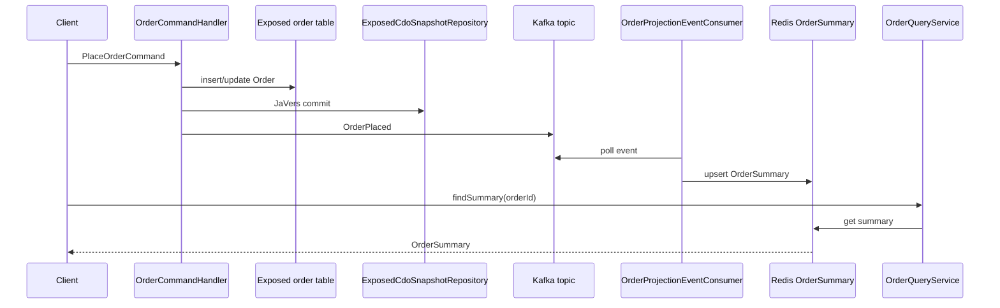
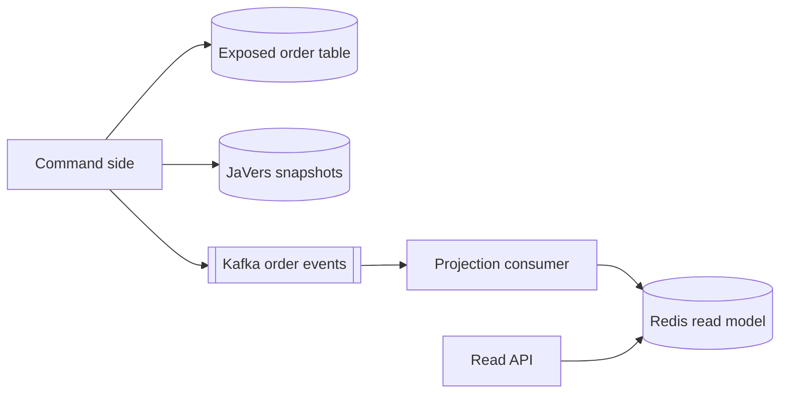

# javers-exposed-ddd

[English](./README.md) | 한국어

JaVers, Exposed JDBC, Kafka, Redis, `javers-ddd` helper를 함께 사용하는 CQRS
예제입니다.

## 흐름





## 포함 범위

- `AggregateRoot<OrderId>`를 구현하는 `Order` aggregate
- `OrderPlaced`, `OrderMarkedPaid` domain event
- Exposed 기반 source-of-truth 주문 저장
- `ExposedCdoSnapshotRepository`를 통한 JaVers snapshot 저장
- Kafka 기반 domain event 발행
- Redis 기반 `OrderSummary` projection
- `OrderQueryService` read-side 조회 API
- H2 command handler 테스트와 Kafka/Redis Testcontainers projection flow

Benchmark 결과는 parent issue #5의 다음 slice에서 다룹니다.

## 실행

```bash
./gradlew :javers-exposed-ddd:test
```
