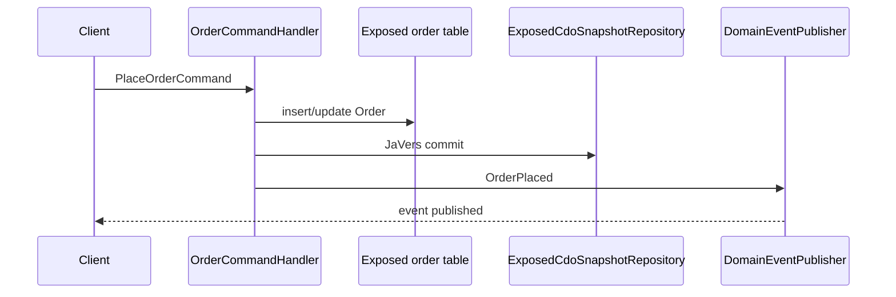

# javers-exposed-ddd

English | [한국어](./README.ko.md)

Command-side CQRS example for JaVers, Exposed JDBC, and the `javers-ddd`
helpers.

## Flow



## What This Example Covers

- `Order` aggregate implementing `AggregateRoot<OrderId>`.
- `OrderPlaced` and `OrderMarkedPaid` domain events.
- Exposed-backed source-of-truth order persistence.
- JaVers snapshots persisted through `ExposedCdoSnapshotRepository`.
- Command handler tests with H2.

Kafka consumers, Redis projections, and benchmark results are handled by the
next slices of parent issue #5.

## Run

```bash
./gradlew :javers-exposed-ddd:test
```
