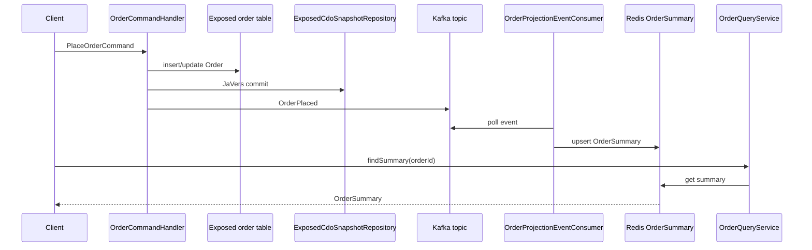
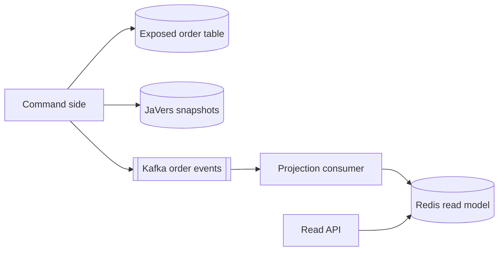

# javers-exposed-ddd

English | [한국어](./README.ko.md)

CQRS example for JaVers, Exposed JDBC, Kafka, Redis, and the `javers-ddd`
helpers.

## Flow





## What This Example Covers

- `Order` aggregate implementing `AggregateRoot<OrderId>`.
- `OrderPlaced` and `OrderMarkedPaid` domain events.
- Exposed-backed source-of-truth order persistence.
- JaVers snapshots persisted through `ExposedCdoSnapshotRepository`.
- Kafka-backed domain event publication.
- Redis-backed `OrderSummary` projection.
- `OrderQueryService` read-side lookup API.
- H2 command handler tests plus Kafka and Redis Testcontainers projection flow.

Benchmark results are handled by the next slice of parent issue #5.

## Run

```bash
./gradlew :javers-exposed-ddd:test
```
