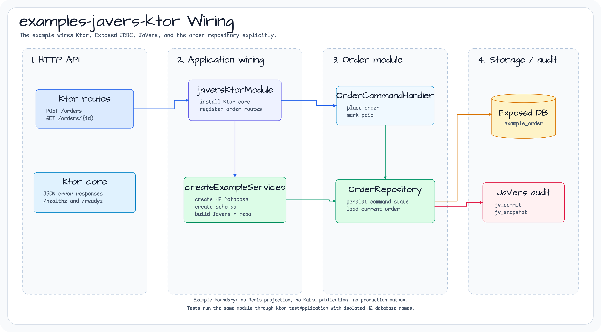
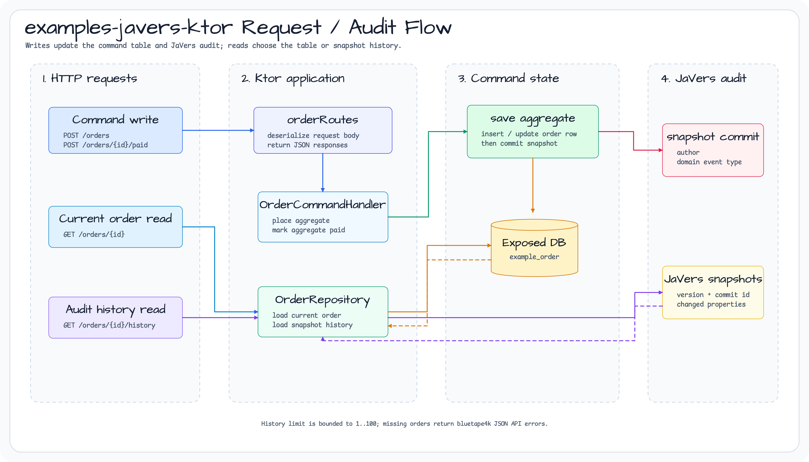

# examples-javers-ktor

[English](./README.md) | 한국어

Exposed JDBC command persistence와 JaVers audit을 함께 사용하는 Ktor REST
예제입니다.

## Architecture

이 예제는 auto-configuration을 사용하지 않고 필요한 객체를 명시적으로
wiring합니다. Ktor module이 H2 기반 Exposed `Database`를 만들고,
command-side table과 JaVers table을 생성한 뒤 `ExposedCdoSnapshotRepository`,
`OrderRepository`, order API route를 연결합니다.



Runtime 요청은 Ktor route에서 command handler로 들어갑니다. 주문 상태는 먼저
`example_order` table에 저장되고, 이후 `AggregateRepository`가 domain-event
metadata와 함께 JaVers snapshot을 commit합니다. 현재 주문 조회는 command
table을 읽고, audit history 조회는 JaVers snapshot을 읽습니다.



## 포함 범위

- `Database`, `Javers`, `OrderRepository`를 명시적으로 wiring하는 Ktor 구성
- Exposed 기반 source-of-truth 주문 저장
- `ExposedCdoSnapshotRepository`를 통한 JaVers snapshot 저장
- `javers-ddd` aggregate repository와 domain-event commit metadata
- `bluetape4k-ktor-core` JSON error, health, readiness route
- 주문 생성, 결제 처리, 조회, audit history Ktor endpoint
- H2 기반 Ktor `testApplication` 통합 테스트

## Endpoint

| Method | Path | 설명 |
|---|---|---|
| `POST` | `/orders` | 주문을 생성하고 첫 JaVers snapshot을 commit합니다. |
| `POST` | `/orders/{orderId}/paid` | 주문을 결제 완료로 변경하고 두 번째 snapshot을 commit합니다. |
| `GET` | `/orders/{orderId}` | 현재 command-side 주문 상태를 반환합니다. |
| `GET` | `/orders/{orderId}/history?limit=20` | 최신순 JaVers snapshot metadata를 반환합니다. |
| `GET` | `/healthz` | bluetape4k Ktor health response를 반환합니다. |
| `GET` | `/readyz` | bluetape4k Ktor readiness response를 반환합니다. |

## 범위

이 예제는 현재 repository 기능만 사용합니다. Redis projection endpoint, Kafka
publication, production outbox, Spring Boot auto-configuration은 제공하지
않습니다.

Gradle project 이름은 `:examples-javers-ktor`입니다. 나중에 publishing rule에서
`examples-javers-*` prefix로 예제 project를 제외할 수 있게 하기 위한 이름입니다.

이 예제는 현재 JaVers Exposed repository가 JDBC 기반이므로 synchronous Exposed
JDBC를 사용합니다. 고동시성 production Ktor 배포에서는 worker dispatcher 격리,
virtual-thread runtime 전략, 또는 future R2DBC 경로를 검토해야 합니다.

## 실행

```bash
./gradlew :examples-javers-ktor:test
```
