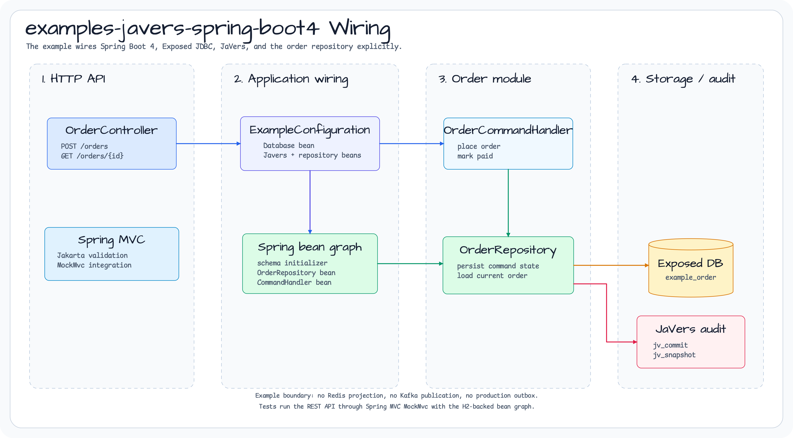
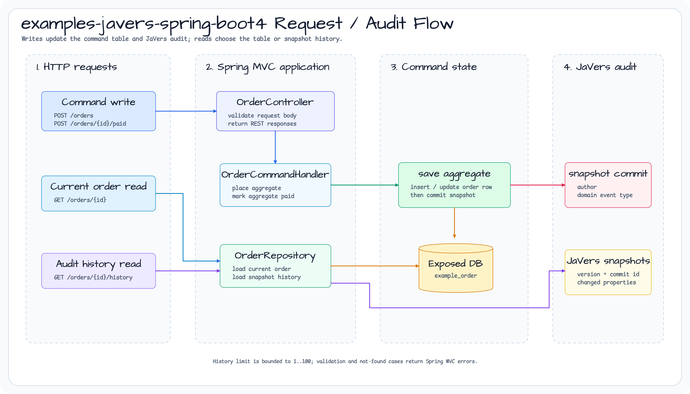

# examples-javers-spring-boot4

[English](./README.md) | 한국어

Exposed JDBC command persistence와 JaVers audit을 함께 사용하는 Spring Boot 4
REST 예제입니다.

## Architecture

이 예제는 auto-configuration 대신 명시적인 Spring bean wiring을 사용합니다.
`JaversExampleConfiguration`이 H2 기반 Exposed `Database`를 만들고,
command-side table과 JaVers table을 초기화한 뒤
`ExposedCdoSnapshotRepository`, order repository, command handler, REST
controller를 연결합니다.



Runtime 요청은 `OrderController`로 들어갑니다. Write endpoint는
`OrderCommandHandler`를 통해 aggregate를 전이하고, repository는 source-of-truth
주문 row를 저장한 뒤 domain-event metadata와 함께 JaVers snapshot을 commit합니다.
현재 주문 조회는 command table을 읽고, audit history 조회는 JaVers snapshot을
읽습니다.



## 포함 범위

- `Database`, `Javers`, `OrderRepository`를 명시적으로 wiring하는 Spring Boot 4 구성
- Exposed 기반 source-of-truth 주문 저장
- `ExposedCdoSnapshotRepository`를 통한 JaVers snapshot 저장
- `javers-ddd` aggregate repository와 domain-event commit metadata
- 주문 생성, 결제 처리, 조회, audit history REST endpoint
- H2 기반 Spring MVC `MockMvc` 통합 테스트

## Endpoint

| Method | Path | 설명 |
|---|---|---|
| `POST` | `/orders` | 주문을 생성하고 첫 JaVers snapshot을 commit합니다. |
| `POST` | `/orders/{orderId}/paid` | 주문을 결제 완료로 변경하고 두 번째 snapshot을 commit합니다. |
| `GET` | `/orders/{orderId}` | 현재 command-side 주문 상태를 반환합니다. |
| `GET` | `/orders/{orderId}/history?limit=20` | 최신순 JaVers snapshot metadata를 반환합니다. |

## 범위

이 예제는 현재 repository 기능만 사용합니다. Spring Boot auto-configuration,
Redis projection endpoint, Kafka publication, production outbox는 제공하지 않습니다.

Gradle project 이름은 `:examples-javers-spring-boot4`입니다. 나중에 publishing
rule에서 `examples-javers-*` prefix로 예제 project를 제외할 수 있게 하기 위한
이름입니다.

## 실행

```bash
./gradlew :examples-javers-spring-boot4:test
```
