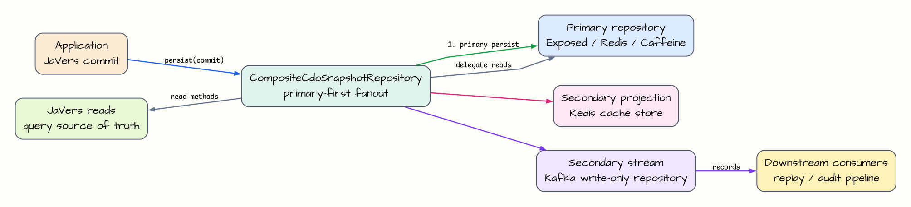

# Module bluetape4k-javers-core

English | [한국어](./README.ko.md)

[JaVers](https://javers.org) extension layer for Kotlin services. This module
contains the shared codec, repository, JQL, metamodel, and convenience APIs used
by every other `bluetape4k-javers` module.

## Features

- Kotlin extension functions for JaVers comparison, snapshot, shadow, and JQL
  workflows.
- `JaversCodec` implementations for string, binary, and compressed snapshot
  payloads.
- `AbstractCdoSnapshotRepository`, the shared base for cache, Redis, Kafka, and
  Exposed snapshot repositories.
- Cache-backed repository implementations for Caffeine, Cache2k, and JCache.
- `CompositeCdoSnapshotRepository` for primary durable storage plus ordered
  secondary fanout to event streams or projection stores.
- Snowflake commit id generation support for cluster-friendly commit metadata.

## Usage

```kotlin
val javers = JaversBuilder.javers()
    .build()

val diff = javers.compare(oldOrder, newOrder)
val snapshot = javers.latestSnapshotOrNull<Order>(orderId)
```

Use `javers-core` directly when the application needs JaVers helper APIs without
a SQL, Redis, or Kafka persistence adapter.

## Composite Repository



Use `CompositeCdoSnapshotRepository` when a service needs one read/query source
of truth and one or more write-side fanout targets:

```kotlin
val repository = CompositeCdoSnapshotRepository(
    primary = exposedRepository,
    secondaryRepositories = listOf(
        redisProjectionRepository,
        kafkaRepository,
    ),
    options = CompositeCdoSnapshotRepositoryOptions(
        writeFailurePolicy = CompositeCdoSnapshotFailurePolicy.FAIL_FAST,
    ),
)

val javers = JaversBuilder.javers()
    .registerJaversRepository(repository)
    .build()
```

Recommended shapes:

| Shape | Primary | Secondary repositories | Notes |
|---|---|---|---|
| Durable history + events | Exposed | Kafka | SQL remains the JaVers query source; Kafka receives audit events. |
| Durable history + projection + events | Exposed | Redis, Kafka | Redis is an explicit projection/cache store, not hidden write-behind. |
| Redis-first audit store + events | Redis | Kafka | Use only when Redis is accepted as the direct JaVers snapshot repository. |

Writes are primary-first. `persist(commit)` calls the primary repository's
native `persist()` implementation first so the primary keeps its own head and
sequence semantics, then fans out to secondary repositories in order. This is
not a distributed transaction: if a secondary fails after the primary succeeds,
the primary may already expose the commit. Use `FAIL_FAST` to stop at the first
secondary failure, or `BEST_EFFORT` to attempt all secondaries and receive an
aggregate exception afterward.

Kafka repositories remain write-only. Use `KafkaCdoSnapshotProjector` from
`javers-persistence-kafka` when Kafka records must be replayed into a
read-capable repository.

## Dependency

```kotlin
dependencies {
    implementation("io.github.bluetape4k.javers:javers-core")
}
```

## Build

```bash
./gradlew :javers-core:test
```
