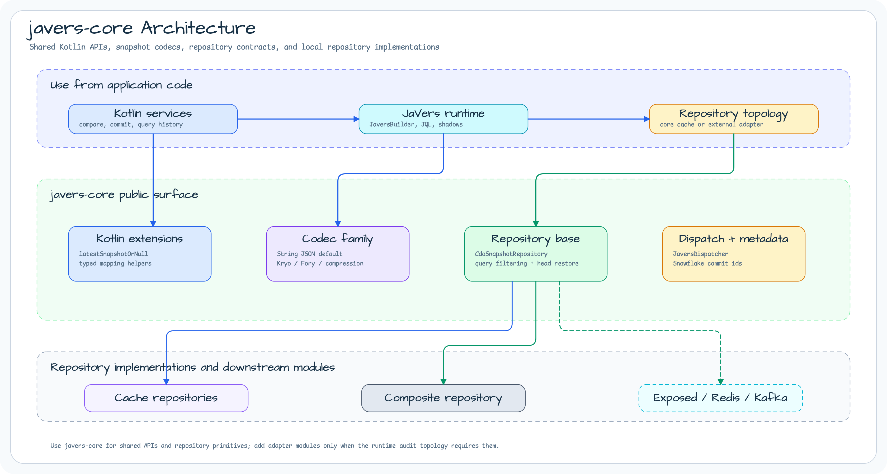
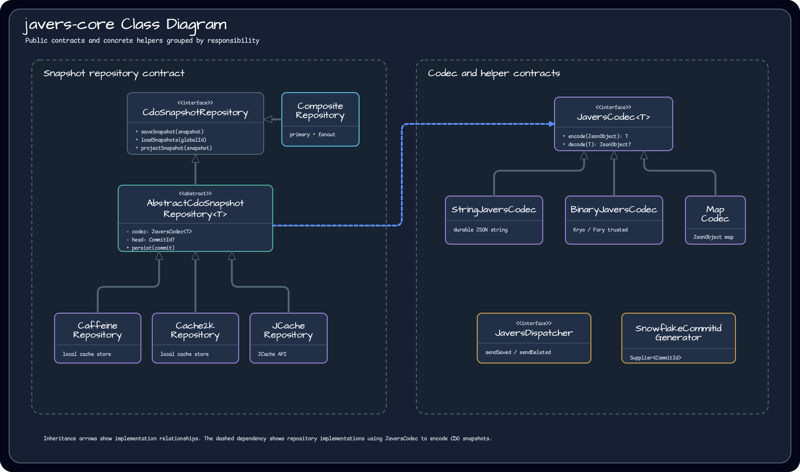
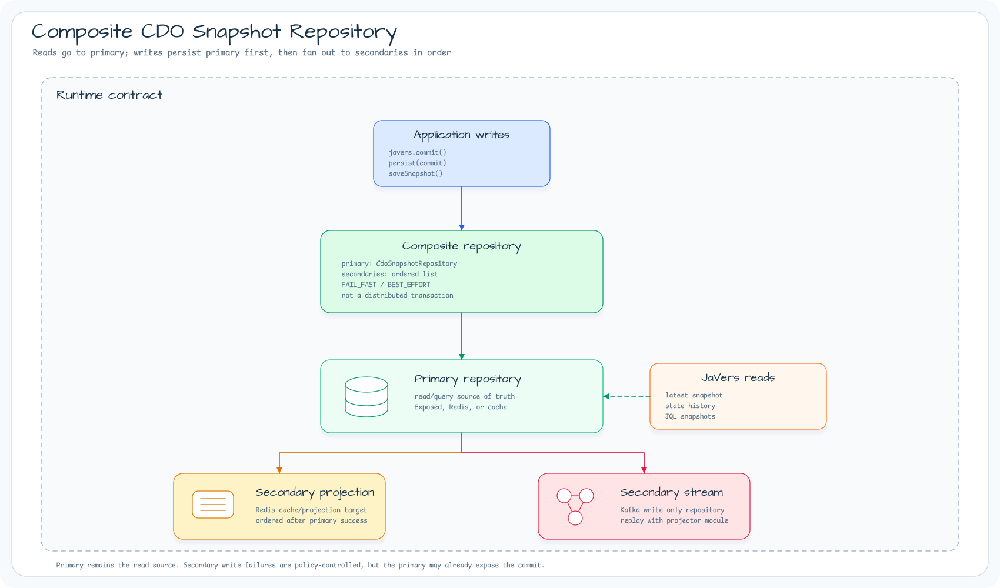

# Module bluetape4k-javers-core

English | [한국어](./README.ko.md)

`javers-core` is the shared JaVers integration layer for Kotlin services. Use it
when an application needs typed JaVers helper APIs, snapshot codecs, cache-backed
repositories, or the repository contracts that Exposed, Redis, and Kafka modules
build on.

This module does not choose a durable topology for the application. It gives you
the common contracts and local implementations; add `javers-exposed`,
`javers-persistence-redis`, or `javers-persistence-kafka` only when the runtime
audit contract needs that adapter.

## Architecture



## Core Responsibilities

- **Kotlin JaVers extensions** for typed entity mapping, collection diffs,
  latest snapshot lookup, shadow reconstruction, and sequence-based shadow
  queries.
- **Snapshot codec family** for JSON strings, compressed JSON strings, trusted
  Kryo/Fory binary payloads, and `JsonObject` map conversion.
- **Repository base contract** through `CdoSnapshotRepository` and
  `AbstractCdoSnapshotRepository`, including common snapshot encoding, head
  tracking, sequence assignment, and JQL-style filtering.
- **Local cache repositories** for Caffeine, Cache2k, and JCache when a service
  wants a local snapshot repository instead of a distributed durable store.
- **Composite repository fanout** for one read/query source of truth plus
  ordered secondary write targets.
- **Dispatcher and metadata helpers** for saved/deleted object dispatch,
  Snowflake-backed commit id generation, and snapshot event envelopes.

## Class Diagram



## Quick Start

```kotlin
val javers = JaversBuilder.javers()
    .build()

val diff = javers.compare(oldOrder, newOrder)
val snapshot = javers.latestSnapshotOrNull<Order>(orderId)
val query = queryByInstanceId<Order>(orderId)
val shadows = javers.findShadowsAndSequence<Order>(query).toList()
```

Use `javers-core` directly when the application only needs JaVers helper APIs or
local cache-backed snapshot storage. If the snapshot history must survive process
restart or be queried by SQL, use the Exposed adapter as the primary repository.

## Codec Choice

Prefer `JaversCodecs.String` for durable JSON storage. Use Kryo or Fory codecs
only for trusted binary payloads where the storage boundary is controlled.

The `JaversCodec.decode` contract returns `null` when a codec cannot restore a
`JsonObject`, including malformed compressed payloads. Repository callers can
therefore skip unreadable snapshots without logging or exposing the raw payload.

The JDK-serialization aliases `JaversCodecs.Jdk`, `DeflateJdk`, `GZipJdk`,
`LZ4Jdk`, `SnappyJdk`, and `ZstdJdk` are obsolete compatibility bridges. They
are error-level deprecated because Java deserialization is unsafe for untrusted
bytes.

## Composite Repository



Use `CompositeCdoSnapshotRepository` when a service needs one read/query source
of truth and one or more write-side fanout targets:

```kotlin
val repository = CompositeCdoSnapshotRepository(
    primary = exposedRepository,
    secondaryRepositories = listOf(
        redisProjectionRepository,
        kafkaRepository,
    ),
    options = CompositeCdoSnapshotRepositoryOptions(
        writeFailurePolicy = CompositeCdoSnapshotFailurePolicy.FAIL_FAST,
    ),
)

val javers = JaversBuilder.javers()
    .registerJaversRepository(repository)
    .build()
```

Recommended shapes:

| Shape | Primary | Secondary repositories | Notes |
|---|---|---|---|
| Durable history + events | Exposed | Kafka | SQL remains the JaVers query source; Kafka receives audit events. |
| Durable history + projection + events | Exposed | Redis, Kafka | Redis is an explicit projection/cache store, not hidden write-behind. |
| Redis-first audit store + events | Redis | Kafka | Use only when Redis is accepted as the direct JaVers snapshot repository. |

Writes are primary-first. `persist(commit)` calls the primary repository's
native `persist()` implementation first so the primary keeps its own head and
sequence semantics, then fans out to secondary repositories in order.

This is not a distributed transaction. If a secondary fails after the primary
succeeds, the primary may already expose the commit. Use `FAIL_FAST` to stop at
the first secondary failure, or `BEST_EFFORT` to attempt all secondaries and
receive an aggregate exception afterward.

Kafka repositories remain write-only. Use `KafkaCdoSnapshotProjector` from
`javers-persistence-kafka` when Kafka records must be replayed into a
read-capable repository.

## Dependency

```kotlin
dependencies {
    implementation("io.github.bluetape4k.javers:javers-core")
}
```

## Build

```bash
./gradlew :javers-core:test
```
