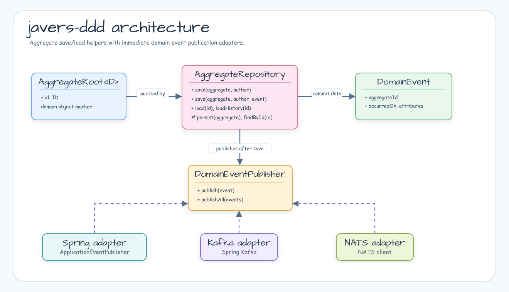

# Module bluetape4k-javers-ddd

[English](./README.md) | 한국어

JaVers 기반 aggregate auditing을 위한 DDD helper layer입니다. Aggregate root와
domain event를 위한 작은 contract, 저장된 aggregate를 JaVers에 commit하는
repository base class, Spring application event, Spring Kafka, NATS용 optional
publisher adapter를 제공합니다.

## 아키텍처



## 기능

- JaVers-managed aggregate root용 `AggregateRoot<ID>` marker.
- JaVers commit property mapping을 제공하는 `DomainEvent` contract.
- save/load/history workflow를 위한 `AggregateRepository<T, ID>` base class.
- `DomainEventPublisher`와 no-op/function/composite publisher.
- Optional Spring `ApplicationEventPublisher`, Spring Kafka, NATS adapter.

## 사용 예

```kotlin
data class Order(
    @Id
    override val id: Long,
    var status: String,
) : AggregateRoot<Long>

data class OrderPlaced(
    override val aggregateId: Long,
    override val occurredOn: Instant = Instant.now(),
) : DomainEvent

class OrderRepository(javers: Javers) :
    AggregateRepository<Order, Long>(Order::class.java, javers) {

    override fun persist(aggregate: Order): Order {
        // Exposed, Spring Data Exposed, 또는 다른 source-of-truth store에 저장합니다.
        return aggregate
    }

    override fun findById(id: Long): Order? = null
}

val repository = OrderRepository(javers)
repository.save(Order(1, "PLACED"), "system", OrderPlaced(1))
val history = repository.loadHistory(1)
```

Aggregate id에는 JaVers `@Id`를 붙이고, `Javers`를 만들 때 aggregate type을
entity로 등록하세요:

```kotlin
val javers = JaversBuilder.javers()
    .registerJaversRepository(exposedSnapshotRepository)
    .registerEntity(Order::class.java)
    .build()
```

## 의존성

```kotlin
dependencies {
    implementation("io.github.bluetape4k.javers:javers-ddd")
}
```

Spring/Kafka/NATS adapter는 optional surface로 컴파일됩니다. 해당 adapter를 사용할
때는 맞는 runtime dependency를 consumer가 추가해야 합니다.

## 전달 의미

`AggregateRepository`는 source persistence와 JaVers commit이 성공한 뒤 event를
발행합니다. 이 기능은 즉시 전달 helper이며 durable outbox 구현이 아닙니다.
정확히 한 번 외부 전달이나 replay가 필요하다면 transactional outbox를 사용하세요.

## 빌드

```bash
./gradlew :javers-ddd:test
```
