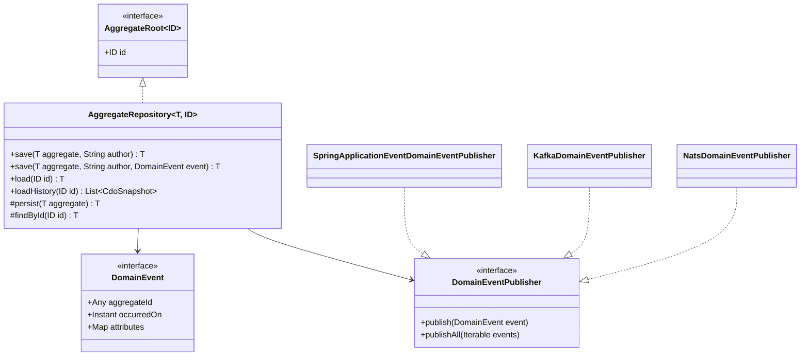

# Module bluetape4k-javers-ddd

English | [한국어](./README.ko.md)

DDD helper layer for JaVers-backed aggregate auditing. This module provides
small contracts for aggregate roots and domain events, an aggregate repository
base class that commits saved aggregates to JaVers, and optional publisher
adapters for Spring application events, Spring Kafka, and NATS.

## Architecture



## Features

- `AggregateRoot<ID>` marker for JaVers-managed aggregate roots.
- `DomainEvent` contract with stable JaVers commit property mapping.
- `AggregateRepository<T, ID>` base class for save/load/history workflows.
- `DomainEventPublisher` plus no-op, function, and composite publishers.
- Optional Spring `ApplicationEventPublisher`, Spring Kafka, and NATS adapters.

## Usage

```kotlin
data class Order(
    @Id
    override val id: Long,
    var status: String,
) : AggregateRoot<Long>

data class OrderPlaced(
    override val aggregateId: Long,
    override val occurredOn: Instant = Instant.now(),
) : DomainEvent

class OrderRepository(javers: Javers) :
    AggregateRepository<Order, Long>(Order::class.java, javers) {

    override fun persist(aggregate: Order): Order {
        // Persist with Exposed, Spring Data Exposed, or another source-of-truth store.
        return aggregate
    }

    override fun findById(id: Long): Order? = null
}

val repository = OrderRepository(javers)
repository.save(Order(1, "PLACED"), "system", OrderPlaced(1))
val history = repository.loadHistory(1)
```

Annotate the aggregate id with JaVers `@Id`, then register aggregate types as
JaVers entities when building `Javers`:

```kotlin
val javers = JaversBuilder.javers()
    .registerJaversRepository(exposedSnapshotRepository)
    .registerEntity(Order::class.java)
    .build()
```

## Dependency

```kotlin
dependencies {
    implementation("io.github.bluetape4k.javers:javers-ddd")
}
```

Spring/Kafka/NATS adapters are compiled as optional surfaces. Add the matching
runtime dependency when using those adapters.

## Delivery Semantics

`AggregateRepository` publishes events after source persistence and the JaVers
commit have succeeded. This is an immediate delivery helper, not a durable
outbox implementation. Use a transactional outbox when exactly-once external
delivery or replay is required.
