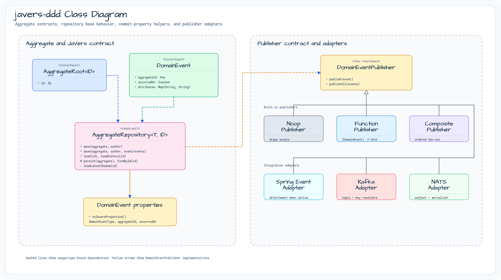
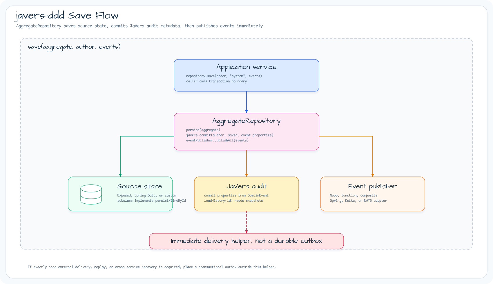

# Module bluetape4k-javers-ddd

English | [한국어](./README.ko.md)

`javers-ddd` is a small DDD helper layer for services that already persist
aggregate roots and want JaVers audit history plus immediate domain-event
publication. It does not replace your source-of-truth repository. Your
repository subclass still owns persistence and lookup; this module adds the
JaVers commit and event-publisher step around that workflow.

## Class Diagram



## Save Flow



## Core Responsibilities

- `AggregateRoot<ID>` marks audited aggregate roots and exposes a stable `id`.
- `DomainEvent` describes an event emitted by an aggregate and maps event
  metadata into JaVers commit properties.
- `AggregateRepository<T, ID>` saves the aggregate through subclass persistence,
  commits the saved state to JaVers, and publishes events after both steps
  succeed.
- `DomainEventPublisher` is a synchronous fail-fast publisher contract.
- Built-in publishers cover no-op, Kotlin function, composite fan-out, Spring
  application events, Spring Kafka, and NATS.

## Usage

```kotlin
data class Order(
    @Id
    override val id: Long,
    var status: String,
) : AggregateRoot<Long>

data class OrderPlaced(
    override val aggregateId: Long,
    override val occurredOn: Instant = Instant.now(),
) : DomainEvent

class OrderRepository(javers: Javers) :
    AggregateRepository<Order, Long>(Order::class.java, javers) {

    override fun persist(aggregate: Order): Order {
        // Persist with Exposed, Spring Data, or another source-of-truth store.
        return aggregate
    }

    override fun findById(id: Long): Order? = null
}

val repository = OrderRepository(javers)
repository.save(Order(1, "PLACED"), "system", OrderPlaced(1))
val history = repository.loadHistory(1)
```

Annotate the aggregate id with JaVers `@Id`, then register aggregate types as
JaVers entities when building `Javers`:

```kotlin
val javers = JaversBuilder.javers()
    .registerJaversRepository(exposedSnapshotRepository)
    .registerEntity(Order::class.java)
    .build()
```

## Publisher Options

Use the smallest publisher that matches the service boundary:

| Publisher | Use when |
|---|---|
| `NoopDomainEventPublisher` | The service only needs JaVers commit metadata. |
| `FunctionDomainEventPublisher` | Tests or small applications can supply a lambda. |
| `CompositeDomainEventPublisher` | Multiple local publishers should run in order. |
| `SpringApplicationEventDomainEventPublisher` | Spring listeners consume events in-process. |
| `KafkaDomainEventPublisher` | Spring Kafka sends domain events to a topic. |
| `NatsDomainEventPublisher` | A NATS connection publishes serialized event payloads. |

Spring and Kafka publishers defer publication to `afterCommit` when Spring
transaction synchronization is active. Otherwise they publish immediately.
NATS publishes synchronously from the repository call using the subject resolver
and serializer supplied by the consumer.

## Delivery Semantics

`AggregateRepository` publishes events after source persistence and the JaVers
commit have succeeded. This is an immediate delivery helper, not a durable
outbox implementation. Use a transactional outbox when exactly-once external
delivery, replay, or cross-service recovery is required.

## Dependency

```kotlin
dependencies {
    implementation("io.github.bluetape4k.javers:javers-ddd")
}
```

Spring, Kafka, and NATS adapters are optional surfaces. Add the matching runtime
dependency only when using the adapter.

## Build

```bash
./gradlew :javers-ddd:test
```
