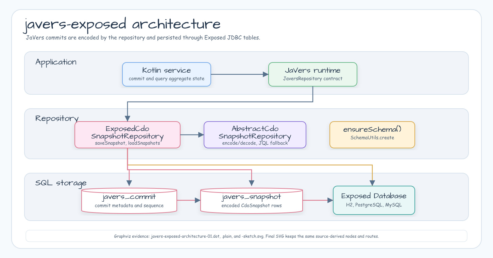
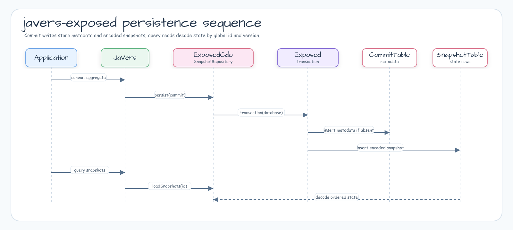

# Module bluetape4k-javers-exposed

English | [한국어](./README.ko.md)

Exposed JDBC persistence for [JaVers](https://javers.org) CDO snapshots.
This module provides `ExposedCdoSnapshotRepository`, an `AbstractCdoSnapshotRepository`
implementation that stores JaVers commits and encoded snapshots in SQL tables
managed through JetBrains Exposed.

## Features

- Stores one row per JaVers commit in `javers_commit`.
- Stores one row per CDO snapshot version in `javers_snapshot`.
- Allows repository-local table names when the default names collide with an
  existing schema or tenant layout.
- Persists the full encoded `CdoSnapshot` payload so JaVers can reconstruct
  snapshots with its configured JSON converter.
- Uses natural primary keys: `commit_id` for commits and `(global_id, version)`
  for snapshots, plus an index on commit sequence for repository head
  restoration.
- Pushes common JaVers snapshot filters into SQL before decoding snapshot JSON.
- Restores the repository head commit id after a repository instance rebuild.
- Audits Exposed DAO `Entity` lifecycle events through an explicit
  `EntityHook` subscription.
- Supports H2, PostgreSQL, and MySQL through Exposed JDBC.

## Architecture



`ExposedCdoSnapshotRepository` extends the shared
`AbstractCdoSnapshotRepository` codec and query behavior, then maps JaVers
commit metadata and encoded `CdoSnapshot` rows to Exposed tables.

## Persistence Flow



Writes run inside an Exposed transaction: the repository inserts commit metadata
when needed, stores the encoded snapshot payload, and later decodes rows ordered
by snapshot version for JaVers queries.

## Usage

```kotlin
val database = Database.connect(
    url = "jdbc:postgresql://localhost:5432/app",
    driver = "org.postgresql.Driver",
    user = "app",
    password = "secret",
)

val repository = ExposedCdoSnapshotRepository(database)
repository.ensureSchema()

val javers = JaversBuilder.javers()
    .registerJaversRepository(repository)
    .build()
```

Use repository options when migrations own the schema or when the default table
names are not acceptable:

```kotlin
val options = ExposedCdoSnapshotRepositoryOptions(
    tableNames = ExposedJaversTableNames(
        commitTableName = "audit_commit",
        snapshotTableName = "audit_snapshot",
    ),
    createSchemaOnEnsure = false,
)

val repository = ExposedCdoSnapshotRepository(
    database = database,
    options = options,
)
```

With `createSchemaOnEnsure = false`, `ensureSchema()` becomes a no-op and the
application must create the mapped tables through Exposed `SchemaUtils`, Flyway,
Liquibase, or another migration tool before writing snapshots.

## DAO EntityHook Audit

`ExposedJaversEntityHookSubscription` can audit Exposed DAO entity lifecycle
events without adding `javers.commit()` calls to every DAO repository method.
It is intentionally scoped to Exposed DAO `EntityHook`; raw Exposed DSL writes,
external database writes, and CDC streams are not observed.

Map each DAO entity class to a detached JaVers audit object:

```kotlin
data class AuditedCustomer(
    @Id val id: Int,
    val name: String,
)

class CustomerEntity(id: EntityID<Int>) : IntEntity(id) {
    companion object : IntEntityClass<CustomerEntity>(Customers)

    var name by Customers.name
}

val mapping = ExposedJaversEntityHookMapping(
    entityClass = CustomerEntity,
    auditType = AuditedCustomer::class.java,
    toAuditObject = { entity ->
        AuditedCustomer(
            id = entity.id.value,
            name = entity.name,
        )
    },
)

val subscription = ExposedJaversEntityHookSubscription.subscribe(
    javers = javers,
    mappings = listOf(mapping),
    authorProvider = { "system" },
    commitPropertiesProvider = { change ->
        mapOf("changeType" to change.changeType.name)
    },
)
```

Close the subscription when the application scope ends:

```kotlin
subscription.close()
```

Created and updated DAO events are committed from the flushed entity state.
Deleted DAO events create a JaVers terminal snapshot by id with
`commitShallowDeleteById()`, so deleted object state is not reloaded after the
row is removed.

## Query Behavior

`ExposedCdoSnapshotRepository` avoids a full repository scan for common JaVers
snapshot queries:

- `getStateHistory(globalId, queryParams)` loads only the requested global id
  when the query does not include aggregate child value objects.
- `getStateHistory(classes, queryParams)` prefilters by persisted managed type
  when the query does not include aggregate child value objects.
- `getSnapshots(queryParams)` pushes exact commit ids, exact version, exact
  author, `LocalDateTime` commit date range, snapshot type, `skip`, and `limit`
  into the SQL query before decoding snapshot JSON.

Queries that need JaVers in-memory semantics still fall back to the shared
repository filtering path. This includes aggregate child value object queries,
changed-property filters, commit-property filters, author-like matching,
`Instant` commit date ranges, version ranges, `toCommitId`, and
`snapshotQueryLimit`.

## Redis + Exposed Latency Strategy

Use `javers-exposed` as the durable JaVers audit source of truth when Exposed
owns the database transaction. Use Redis near-cache or read/write-through
behavior for application read models and projections, not for canonical
`CdoSnapshot` rows or repository head metadata.

The recommended reuse path is the existing `bluetape4k-exposed` cache stack:

- `exposed-cache` defines `CacheMode`, `CacheWriteMode`, local cache options,
  resilience options, and reusable repository test fixtures.
- `exposed-jdbc-redisson` provides Redisson read-through, write-through,
  write-behind, and near-cache repositories.
- `exposed-jdbc-lettuce` provides Lettuce read-through, write-through, and
  write-behind repositories.

| Strategy | Use for JaVers + Exposed | Avoid for |
|---|---|---|
| Cache-aside | Rebuildable query results or projections derived from audit history. | Canonical audit snapshot writes. |
| Read-through | Exposed read-model repositories that already fit `bluetape4k-exposed` cache contracts. | Replacing the raw JaVers `CdoSnapshot` repository. |
| Write-through | Mutable read models when synchronous Redis + database latency is acceptable. | JaVers audit writes that must preserve commit ordering. |
| Write-behind | Non-authoritative projections with explicit replay or drain failure handling. | Audit log writes, commit sequence, and repository head metadata. |
| Near-cache | Hot read-model lookups with Redisson or Lettuce local cache support. | Canonical snapshot/head state unless a composite repository owns invalidation. |

`javers-persistence-redis` is a direct Redis audit store. It should not be
wrapped as a write-behind cache for this SQL-backed repository. A future
composite repository can combine durable history and event/projection behavior,
but it must own invalidation, replay, and failure semantics explicitly.

## Build

```bash
./gradlew :javers-exposed:test
```

## References

- [JaVers](https://javers.org)
- [JetBrains Exposed](https://www.jetbrains.com/exposed/)
