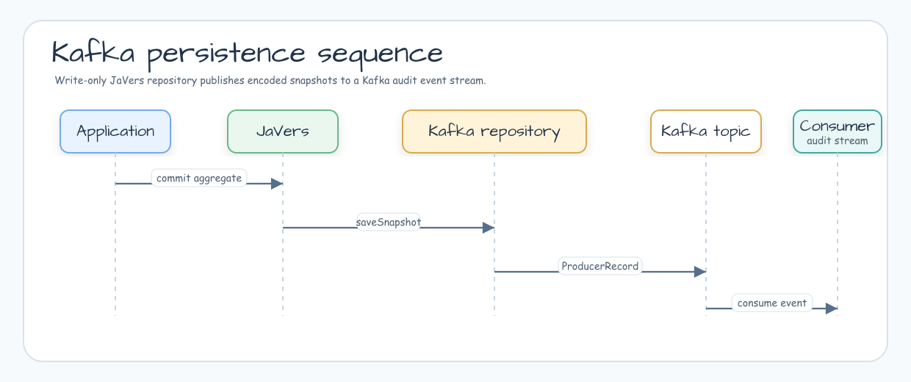

# Module bluetape4k-javers-persistence-kafka

[English](./README.md) | 한국어

Kafka로 JaVers CDO snapshot을 발행하는 모듈입니다. 이 모듈은 의도적으로
write-only입니다. Snapshot을 Kafka record로 직렬화해 downstream system이 audit
event를 소비할 수 있게 하며, repository read method는 빈 값이나 기본값을 반환합니다.

## 아키텍처



## 기능

- Spring Kafka `KafkaTemplate`로 encoded JaVers snapshot을 발행하는 `KafkaCdoSnapshotRepository`.
- Spring Kafka API 없이 Apache Kafka `Producer`로 snapshot을 발행하는 `VanillaKafkaCdoSnapshotRepository`.
- Kafka publisher adapter가 공유하는 transport-neutral `CdoSnapshotEvent` metadata contract.
- Kafka topic, key mapping, publish timeout, flush 동작, producer lifecycle ownership 설정.
- write-only contract가 보이도록 첫 read path에서 warning log 출력, 반복 메시지는 debug로 완화.
- Kafka send 실패 propagation.
- `javers-core` codec 재사용.

## 사용 예

### Spring Kafka

```kotlin
val repository = KafkaCdoSnapshotRepository(
    kafkaOperations = kafkaTemplate,
)

val javers = JaversBuilder.javers()
    .registerJaversRepository(repository)
    .build()
```

### Vanilla Kafka

애플리케이션이 Apache Kafka `Producer<String, String>`를 직접 소유하거나 Spring
Kafka API로 wiring하지 않으려면 vanilla repository를 사용합니다:

```kotlin
val options = VanillaKafkaCdoSnapshotRepositoryOptions(
    topic = "order-audit-events",
    publishTimeout = Duration.ofSeconds(10),
)

val repository = VanillaKafkaCdoSnapshotRepository(
    producer = producer,
    options = options,
)

val javers = JaversBuilder.javers()
    .registerJaversRepository(repository)
    .build()
```

Repository가 governed `bluetape4k-kafka` `producerOf(...)` helper로 producer를
생성하게 할 수도 있습니다:

```kotlin
val repository = VanillaKafkaCdoSnapshotRepository(
    mapOf(
        ProducerConfig.BOOTSTRAP_SERVERS_CONFIG to "localhost:9092",
        ProducerConfig.ACKS_CONFIG to "all",
    ),
    options,
)
```

Repository가 producer를 생성하면 producer를 소유하고 닫습니다. `Producer<String,
String>`를 직접 넘기면 `closeProducerOnClose = true`를 설정하지 않는 한 producer
lifecycle은 호출자가 소유합니다.

Kafka를 audit event stream으로 사용할 때 이 모듈을 사용하세요. 애플리케이션이
history read도 필요하다면 durable snapshot repository나 projection consumer와
함께 사용해야 합니다.

## Snapshot Event Pipeline

두 Kafka repository는 publish 전에 `CdoSnapshotEvent<String>`을 생성합니다. 이
event는 Kafka key, publish diagnostics, future transport behavior를 도출하기 위한
in-process adapter contract입니다. 현재 Kafka wire record value는 metadata
envelope이 아니라 encoded JaVers snapshot payload(`event.payload`)입니다.

In-process event metadata는 다음 값을 포함합니다:

- global id value
- commit id, major id, minor id
- nullable repository sequence
- snapshot version과 type
- author와 commit timestamp
- codec id와 opaque idempotency key

`repositorySequence`는 JaVers가 `saveSnapshot()` 성공 뒤에 repository sequence를
배정하기 때문에 nullable입니다. Transport adapter는 idempotency key를 opaque 값으로
취급해야 합니다.

Kafka consumer는 위 metadata가 현재 record header나 record value에 들어 있다고
가정하면 안 됩니다. Projection이나 future adapter가 wire-visible metadata를 필요로
한다면 header나 envelope 같은 명시적 wire contract를 정의하고 consumer-facing test를
추가해야 합니다.

### Kafka Key Diagnostics

Kafka record key는 transport routing contract의 일부이므로 변경하지 않습니다.
Diagnostics는 raw key를 노출하지 않습니다. JaVers global id에는 email, account number,
tenant identifier 같은 natural identifier가 포함될 수 있기 때문입니다.

Log와 exception message에는 다음 값만 사용합니다:

- `keyFingerprint=<sha256-prefix>`: UTF-8 key SHA-256 digest의 앞 16 hex 문자.
- `keyLength=<n>`: raw key의 character length.

Raw key, partial key, prefix, suffix, masked key variant는 log나 thrown exception
message에 포함하지 않습니다.

Fingerprint는 anonymization이 아니라 pseudonymous correlation value입니다.
같은 key의 반복 실패를 운영자가 연결할 수 있도록 deterministic하게 유지하지만,
더 강한 privacy requirement가 있는 애플리케이션은 이 diagnostics를 trusted telemetry
boundary 밖으로 export하지 않아야 합니다.

### Delivery and Retry Semantics

Kafka publishing은 synchronous at-least-once 방식입니다. Repository는 Kafka send
acknowledgement를 기다리고 publish 실패를 propagation해서 실패한 publish 뒤 JaVers
audit-log head가 advance되지 않도록 합니다.

여러 snapshot을 만드는 commit에서는 같은 commit의 앞선 snapshot이 이미 publish된 뒤
뒤쪽 snapshot publish가 실패할 수 있습니다. 이 작업을 retry하면 앞서 publish된 snapshot
event가 중복될 수 있습니다. 현재 Kafka consumer는 idempotency key를 wire에서 볼 수
없으므로 duplicate 가능성을 전제로 처리해야 합니다. Projection/replay 작업이나 future
wire contract는 opaque idempotency key를 노출해 사용하거나, 다른 transport-specific
deduplication policy를 정의해야 합니다.

Read-side projection 작업(#105)과 durable history plus event-stream composition
작업(#131)은 replay, retry, transaction, outbox coordination을 추가할 때 이
partial-publish behavior를 명시적으로 유지해야 합니다.

## Adapter 선택 기준

| Adapter | Runtime dependency | 사용 시점 |
|---|---|---|
| `KafkaCdoSnapshotRepository` | 호출자가 제공하는 Spring Kafka `KafkaTemplate`. | 애플리케이션이 이미 Spring Kafka를 사용할 때. |
| `VanillaKafkaCdoSnapshotRepository` | 호출자가 제공하는 Apache Kafka `Producer<String, String>` 또는 governed `bluetape4k-kafka` config 기반 `producerOf(...)`. | Spring 기반이 아니거나 producer lifecycle을 직접 소유할 때. |

`VanillaKafkaCdoSnapshotRepository.close()`는 `closeProducerOnClose = true`를
설정하지 않으면 producer를 닫지 않습니다. 애플리케이션 수준 Kafka client lifecycle이
producer를 이미 소유한다면 기본값을 유지하세요.

## 예정된 Non-Kafka Adapter

Core event contract는 transport-neutral이지만, 이 모듈은 Kafka만 구현합니다.
Non-Kafka adapter는 metadata를 transport header, envelope 또는 다른 명시적 wire
contract로 노출할지 결정해야 합니다.

| 예정 adapter | 현재 상태 | 참고 |
|---|---|---|
| NATS JetStream | Design artifact only. | 구현 전 publish acknowledgement, subject mapping, metadata header 계약이 필요합니다. |
| Amazon SQS | Design artifact only. | FIFO group/deduplication 설정은 queue type별로 분리해야 하며, AWS SDK dependency 결정은 별도입니다. |

Kafka write-only publishing은 read-side projection 작업(#105), durable history와
event stream composition 작업(#131)과 분리되어 있습니다.

## 의존성

```kotlin
dependencies {
    implementation("io.github.bluetape4k.javers:javers-persistence-kafka")
}
```

## 빌드

```bash
./gradlew :javers-persistence-kafka:test
```

## 참고 자료

- [JaVers](https://javers.org)
- [Apache Kafka](https://kafka.apache.org/)
