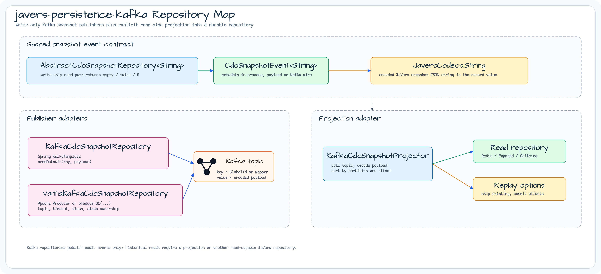
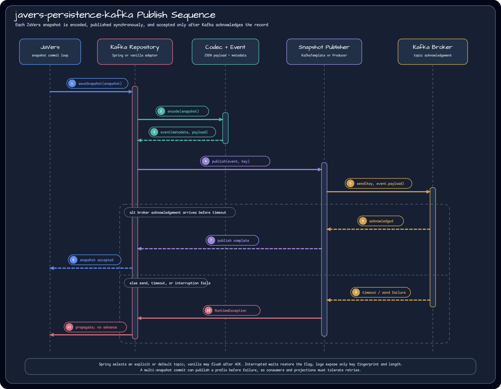
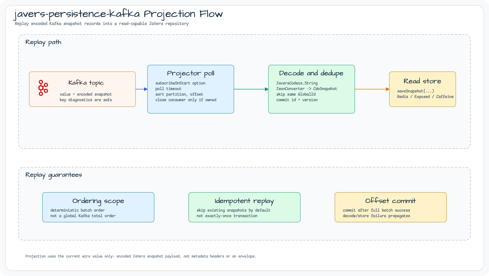

# Module bluetape4k-javers-persistence-kafka

English | [한국어](./README.ko.md)

Kafka-backed JaVers CDO snapshot publisher. This module is intentionally
write-only: it serializes snapshots to Kafka records so downstream systems can
consume audit events, while repository read methods return empty/default values.

## Repository map



Kafka repositories publish audit events only. Use
`KafkaCdoSnapshotRepository` when the application already uses Spring Kafka, and
`VanillaKafkaCdoSnapshotRepository` when the application owns an Apache Kafka
`Producer<String, String>` directly. Both adapters share the same encoded
snapshot event contract. Historical reads require `KafkaCdoSnapshotProjector` or
another read-capable JaVers repository.

## Publish flow



Each saved JaVers snapshot is encoded as the current Kafka wire value. The
in-process `CdoSnapshotEvent<String>` carries metadata for key mapping,
diagnostics, and future transport behavior, but consumers should treat the
record value as the encoded JaVers snapshot payload today.

## Projection flow



`KafkaCdoSnapshotProjector` replays encoded snapshot records into a read-capable
`CdoSnapshotRepository`. It applies each polled batch in deterministic
`partition, offset` order, can skip snapshots already present in the target
repository, and commits offsets only after the batch is projected successfully.

## Features

- `KafkaCdoSnapshotRepository` for Spring Kafka `KafkaTemplate` publishing.
- `VanillaKafkaCdoSnapshotRepository` for Spring Kafka API-free Apache Kafka `Producer` publishing.
- `KafkaCdoSnapshotProjector` for explicit read-side replay into an existing `CdoSnapshotRepository`.
- Transport-neutral `CdoSnapshotEvent` metadata contract shared by Kafka publisher adapters.
- Configurable Kafka topic, key mapping, publish timeout, flush behavior, and producer lifecycle ownership.
- Explicit first read-path warning, with repeated write-only contract messages demoted to debug.
- Failure propagation from Kafka send operations.
- Codec reuse from `javers-core`.

## Usage

### Spring Kafka

```kotlin
val repository = KafkaCdoSnapshotRepository(
    kafkaOperations = kafkaTemplate,
    topic = "order-audit-events",
)

val javers = JaversBuilder.javers()
    .registerJaversRepository(repository)
    .build()
```

### Vanilla Kafka

Use the vanilla repository when the application already owns an Apache Kafka
`Producer<String, String>` or wants to avoid wiring through Spring Kafka APIs:

```kotlin
val options = VanillaKafkaCdoSnapshotRepositoryOptions(
    topic = "order-audit-events",
    publishTimeout = Duration.ofSeconds(10),
)

val repository = VanillaKafkaCdoSnapshotRepository(
    producer = producer,
    options = options,
)

val javers = JaversBuilder.javers()
    .registerJaversRepository(repository)
    .build()
```

You can also let the repository create a repository-owned producer from Kafka
configuration through the governed `bluetape4k-kafka` `producerOf(...)` helper:

```kotlin
val repository = VanillaKafkaCdoSnapshotRepository(
    mapOf(
        ProducerConfig.BOOTSTRAP_SERVERS_CONFIG to "localhost:9092",
        ProducerConfig.ACKS_CONFIG to "all",
    ),
    options,
)
```

When the repository creates the producer, it also owns and closes it. When you
pass a `Producer<String, String>` directly, producer lifecycle remains
caller-owned unless `closeProducerOnClose = true` is set.

Use this module when Kafka is the audit event stream. Pair it with a durable
snapshot repository or a projection consumer when the application also needs
historical reads.

### Read-side Projection

Kafka repositories stay write-only. When the application needs historical reads,
project the Kafka stream into a read-capable `CdoSnapshotRepository` such as the
Redis, Exposed, or Caffeine repositories from the bluetape4k JaVers ecosystem:

```kotlin
val readRepository = LettuceCdoSnapshotRepository("audit-read", redisClient)
val readJavers = JaversBuilder.javers()
    .registerJaversRepository(readRepository)
    .build()

val projector = KafkaCdoSnapshotProjector(
    consumerConfigs = mapOf(
        ConsumerConfig.BOOTSTRAP_SERVERS_CONFIG to "localhost:9092",
        ConsumerConfig.GROUP_ID_CONFIG to "audit-projection",
        ConsumerConfig.AUTO_OFFSET_RESET_CONFIG to "earliest",
        ConsumerConfig.ENABLE_AUTO_COMMIT_CONFIG to false,
    ),
    jsonConverter = readJavers.jsonConverter,
    projectionRepository = readRepository,
    options = KafkaCdoSnapshotProjectionOptions(topic = "order-audit-events"),
)

projector.use {
    it.replayUntilIdle(maxIdlePolls = 2)
}
```

The projector uses the governed `bluetape4k-kafka` `consumerOf(...)` helper when
it creates a repository-owned consumer from configuration. You can also pass a
caller-owned `Consumer<String, String>` directly.

## Snapshot Event Pipeline

Both Kafka repositories build a `CdoSnapshotEvent<String>` before publishing.
This is an in-process adapter contract used to derive Kafka keys, publish
diagnostics, and future transport behavior. The current Kafka wire record value
is still the encoded JaVers snapshot payload (`event.payload`), not a metadata
envelope.

The in-process event metadata carries:

- global id value
- commit id, major id, and minor id
- nullable repository sequence
- snapshot version and type
- author and commit timestamp
- codec id and opaque idempotency key

`repositorySequence` is nullable because JaVers assigns repository sequence
after `saveSnapshot()` succeeds. Transport adapters should treat the
idempotency key as opaque.

Kafka consumers should not assume that the metadata above is present in record
headers or the record value today. If a projection or future adapter needs
wire-visible metadata, it must define that contract explicitly with headers or
an envelope and add consumer-facing tests.

### Kafka Key Diagnostics

Kafka record keys remain unchanged because they are part of the transport
routing contract. Diagnostics do not expose raw keys because JaVers global ids
can include natural identifiers such as emails, account numbers, or tenant
identifiers.

Logs and exception messages use only:

- `keyFingerprint=<sha256-prefix>`: the first 16 hex characters of the UTF-8
  key SHA-256 digest.
- `keyLength=<n>`: the raw key character length.

Raw keys, partial keys, prefixes, suffixes, and masked key variants are not
logged or included in thrown exception messages.

The fingerprint is a pseudonymous correlation value, not anonymization. It
remains deterministic so operators can correlate repeated failures for the same
key, but applications with stricter privacy requirements should avoid exporting
these diagnostics outside their trusted telemetry boundary.

### Delivery and Retry Semantics

Kafka publishing is synchronous and at-least-once. The repositories wait for the
Kafka send acknowledgement and propagate publish failures so JaVers does not
advance the audit-log head after a failed publish.

For commits that produce multiple snapshots, a failure can happen after earlier
snapshots in the same commit were already published. Retrying the operation can
therefore duplicate those earlier snapshot events. Current Kafka consumers
should treat duplicates as possible because the idempotency key is not
wire-visible today. Projection/replay work or future wire contracts should
expose and use the opaque idempotency key, or define another
transport-specific deduplication policy.

Read-side projection work (#105) and durable-history plus event-stream
composition (#131) must keep this partial-publish behavior explicit when they
add replay, retry, transaction, or outbox coordination.

### Projection Replay Semantics

`KafkaCdoSnapshotProjector` consumes the current Kafka wire value: the encoded
JaVers snapshot payload. It does not require a metadata envelope or headers.

The projector requires the snapshot topic to have exactly one partition. It
validates the topic topology before the first poll and throws
`IllegalStateException` for a multi-partition topic. The current wire value does
not carry the source repository sequence, so projecting records from multiple
partitions would assign target-local sequences in poll order and could silently
change the global JaVers head. A future multi-partition projector must define a
wire-visible monotonic sequence before this restriction can be relaxed.

Within the single-partition topic, each polled batch is applied in deterministic
`partition, offset` order.

By default the projector checks the target repository for an existing snapshot
with the same GlobalId, commit id, and version before saving. This makes replay
idempotent for duplicate snapshot records already materialized in the read
store. It is not an exactly-once Kafka transaction guarantee.

When offset commits are enabled, offsets are committed only after the complete
polled batch is decoded and saved or skipped successfully. Decode failures and
target repository failures are propagated so the caller can retry.

## Adapter Selection

| Adapter | Runtime dependency | Use when |
|---|---|---|
| `KafkaCdoSnapshotRepository` | Spring Kafka `KafkaTemplate` supplied by the caller. | The application already uses Spring Kafka. |
| `VanillaKafkaCdoSnapshotRepository` | Apache Kafka `Producer<String, String>` supplied by the caller, or `producerOf(...)` from governed `bluetape4k-kafka` config. | The application is not Spring-based or owns producer lifecycle directly. |

`VanillaKafkaCdoSnapshotRepository.close()` does not close the producer unless
`closeProducerOnClose = true` is set. Keep the default when an application-level
Kafka client lifecycle already owns the producer.

## Planned Non-Kafka Adapters

The core event contract is transport-neutral, but this module implements Kafka
only. Non-Kafka adapters must decide whether metadata is exposed as transport
headers, an envelope, or another explicit wire contract.

| Planned adapter | Current status | Notes |
|---|---|---|
| NATS JetStream | Design artifact only. | Publish acknowledgement, subject mapping, and metadata headers must be defined before implementation. |
| Amazon SQS | Design artifact only. | FIFO group/deduplication settings must stay queue-type-specific, and an AWS SDK dependency decision is still separate. |

Kafka write-only publishing remains separate from read-side projection work
(#105) and durable-history plus event-stream composition (#131).

## Dependency

```kotlin
dependencies {
    implementation("io.github.bluetape4k.javers:javers-persistence-kafka")
}
```

## Build

```bash
./gradlew :javers-persistence-kafka:test
```

## References

- [JaVers](https://javers.org)
- [Apache Kafka](https://kafka.apache.org/)
