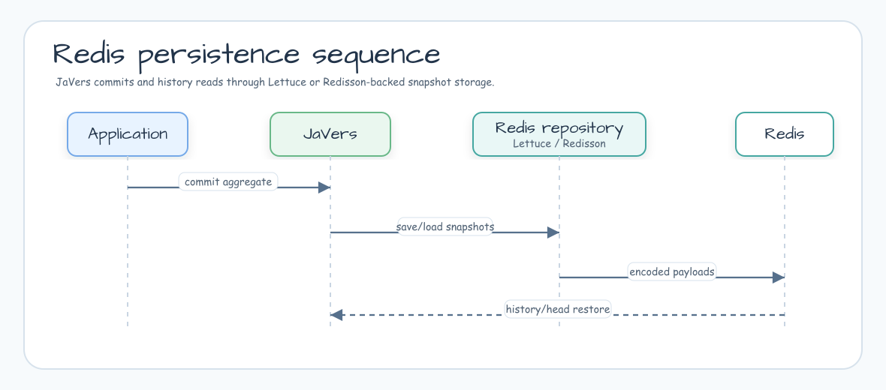

# Module bluetape4k-javers-persistence-redis

[English](./README.md) | 한국어

Redis를 JaVers CDO snapshot 저장소로 사용하기 위한 repository 모듈입니다.
기본 JaVers store 대신 Redis에 audit history를 저장하고 싶을 때 사용합니다.

## 아키텍처



## 기능

- Lettuce 기반 `LettuceCdoSnapshotRepository`.
- Redisson 기반 `RedissonCdoSnapshotRepository`.
- JaVers global id별 encoded snapshot 저장.
- repository instance rebuild 후에도 head를 복원할 수 있는 commit id sequence 추적.
- `javers-core`의 shared codec 지원.

## 사용 예

```kotlin
val repository = LettuceCdoSnapshotRepository(
    name = "orders",
    commands = redisCommands,
)

val javers = JaversBuilder.javers()
    .registerJaversRepository(repository)
    .build()
```

Redis를 audit snapshot store로 사용할 때 이 모듈을 사용하세요. CQRS read model은
JaVers snapshot data와 분리된 application projection으로 유지하는 편이 좋습니다.

## 의존성

```kotlin
dependencies {
    implementation("io.github.bluetape4k.javers:javers-persistence-redis")
}
```

## 빌드

```bash
./gradlew :javers-persistence-redis:test
```

## 참고 자료

- [JaVers](https://javers.org)
- [Redis](https://redis.io/)
