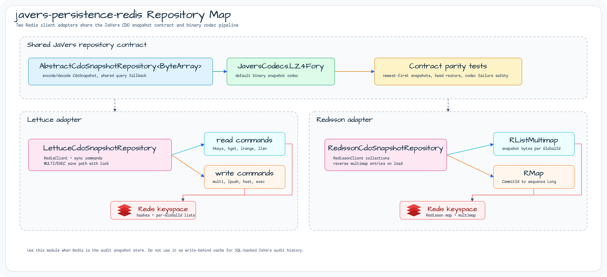
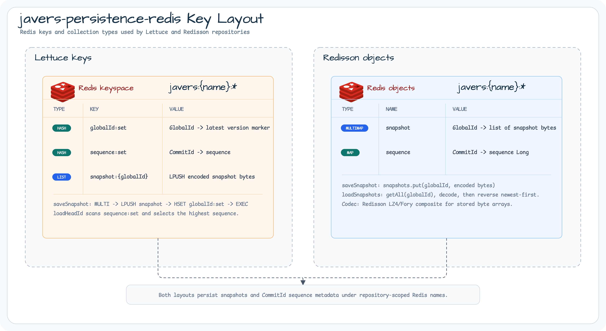
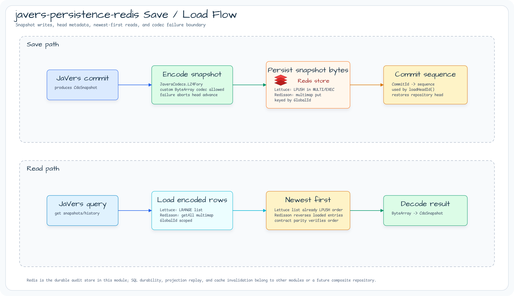

# Module bluetape4k-javers-persistence-redis

English | [한국어](./README.ko.md)

Redis-backed JaVers CDO snapshot repositories for applications that use Redis as
the durable audit snapshot store instead of the built-in JaVers stores.

## Repository map



This module publishes two repository implementations over the same JaVers
snapshot contract. `LettuceCdoSnapshotRepository` stays close to Redis commands
and explicit `MULTI`/`EXEC` writes. `RedissonCdoSnapshotRepository` uses
Redisson collections while preserving the same newest-first query behavior,
head restoration, and codec failure boundary.

## Redis key layout



Lettuce stores repository-scoped Redis hashes for global ids and commit sequence
metadata, plus one list per JaVers global id for encoded snapshots. Redisson
stores the same audit data through a multimap for snapshots and a map for commit
sequences. Both layouts use repository-scoped names derived from `name`, so
different audit stores can share the same Redis deployment without key
collisions.

## Save and load flow



Snapshot writes encode `CdoSnapshot` instances through the configured
`JaversCodec<ByteArray>` before the repository advances the head metadata. Read
paths load encoded rows by JaVers global id, normalize the result to newest-first
order, and decode bytes back to JaVers snapshots.

## Features

- `LettuceCdoSnapshotRepository` for Lettuce-based Redis access.
- `RedissonCdoSnapshotRepository` for Redisson-based Redis access.
- Encoded snapshot storage keyed by JaVers global id.
- Commit id sequence tracking so repository heads survive instance rebuilds.
- Shared `JaversCodecs.LZ4Fory` default with custom `JaversCodec<ByteArray>`
  support from `javers-core`.

## Usage

```kotlin
val repository = LettuceCdoSnapshotRepository(
    name = "orders",
    client = redisClient,
)

val javers = JaversBuilder.javers()
    .registerJaversRepository(repository)
    .build()
```

## Lifecycle

`LettuceCdoSnapshotRepository.close()` is terminal. It closes only the read/write
connections opened by the repository; every read/write operation after close fails
with `IllegalStateException`, and the caller-owned `RedisClient` remains running.
Close the repository before shutting down the client.

Use this module when Redis is the audit snapshot store. For query-side CQRS read
models, keep application projections separate from the JaVers snapshot data.

## Repository selection

Both repositories share the same JaVers snapshot contract: snapshots are queried
newest-first, commit id sequence metadata is persisted so the repository head can
be rebuilt, and codec failures propagate without advancing the head commit.

Choose `LettuceCdoSnapshotRepository` when the application already standardizes
on Lettuce, needs explicit Redis command/transaction control, or wants the
smallest Redis client abstraction around the JaVers audit store.

Choose `RedissonCdoSnapshotRepository` when the application already standardizes
on Redisson, benefits from higher-level Redis collections, or plans to evaluate
Redisson near-cache and read/write-through strategies in a follow-up layer.

This module intentionally does not define a provider-neutral cache contract.
Near-cache, read-through, write-through, and write-behind behavior should reuse
the existing bluetape4k cache and Exposed cache modules before JaVers-specific
mapping code is added.

When Exposed is the durable audit store, use `javers-exposed` for canonical
snapshot history and apply Redisson/Lettuce cache strategies to read models or
projections through `bluetape4k-exposed`. Do not use this Redis repository as a
write-behind cache for SQL-backed audit writes, commit sequence metadata, or
repository head restoration.

## Dependency

```kotlin
dependencies {
    implementation("io.github.bluetape4k.javers:javers-persistence-redis")
}
```

## Build

```bash
./gradlew :javers-persistence-redis:test
```

## References

- [JaVers](https://javers.org)
- [Redis](https://redis.io/)
